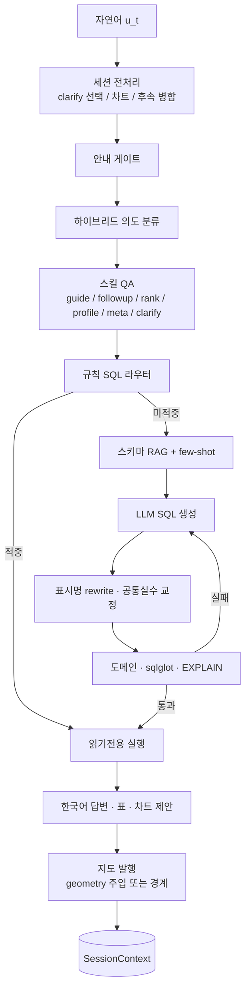

# 연구 결과보고서 (고도화본)

## 행정거버넌스 지원을 위한 자연어 GIS 질의·검증·시각화 알고리즘

| 항목 | 내용 |
|------|------|
| 연구 과제명 | 행정거버넌스 지원을 위한 알고리즘 작성 (후속·고도화) |
| 선행 연구 | `llm2_geodb` — GIS DB 대화형 이해·오케스트레이션 (해석·안전 실행) |
| 본 결과물 | `txt2sql` v0.1.4 시점의 자연어→SQL 생성·검증·실행·한국어 답변·지도 발행 |
| 본 보고서 범위 | **개선·신규 알고리즘** (의도 하이브리드, 규칙 SQL 라우터, 스키마 RAG, Text-to-SQL 검증 루프, 지명 사전, 세션·모호성, 단위 정규화, 지도 발행) |
| 선행 보고서 | `llm2_geodb/docs/RND_대화형GIS해석_알고리즘_연구결과보고서.md` |
| 구현 스택 | Ollama(로컬 LLM·임베딩) · PostgreSQL/PostGIS · FastAPI/CLI · GeoServer(선택) · sqlglot |
| 현재 제품 | **txt2sql 0.3.0** (SQP v1.1, 기본 `hybrid`). 본문은 0.1.4 알고리즘을 보존한다. 복합조건·SQP는 [§9.4](#94-semantic-query-plan-022-추가)와 부록 C를 본다 |

> **문서 성격**: 이 보고서는 고도화 연구 당시(v0.1.4)의 알고리즘을 고정한 기록이다. 제품 동작·설정·복합질의는 `README.md`, `docs/작동방식_및_알고리즘.md`, `docs/Semantic_Query_Plan_구현.md`가 우선한다.

---

## 목차

1. [연구 배경·문제 정의](#1-연구-배경문제-정의)
2. [연구 목표·기여](#2-연구-목표기여)
3. [선행 대비 고도화 요약](#3-선행-대비-고도화-요약)
4. [시스템 아키텍처](#4-시스템-아키텍처)
5. [기호·자료구조·상태](#5-기호자료구조상태)
6. [전체 오케스트레이션 알고리즘](#6-전체-오케스트레이션-알고리즘)
7. [세부 알고리즘 A — 하이브리드 의도 분류](#7-세부-알고리즘-a--하이브리드-의도-분류)
8. [세부 알고리즘 B — 지명 사전 최장일치](#8-세부-알고리즘-b--지명-사전-최장일치)
9. [세부 알고리즘 C — 규칙 SQL 라우터](#9-세부-알고리즘-c--규칙-sql-라우터)
10. [세부 알고리즘 D — 공간 범위·템플릿](#10-세부-알고리즘-d--공간-범위템플릿)
11. [세부 알고리즘 E — 라우트 디스패치 최적화](#11-세부-알고리즘-e--라우트-디스패치-최적화)
12. [세부 알고리즘 F — 스키마 RAG](#12-세부-알고리즘-f--스키마-rag)
13. [세부 알고리즘 G — Text-to-SQL 검증·재시도](#13-세부-알고리즘-g--text-to-sql-검증재시도)
14. [세부 알고리즘 H — 거버넌스 안전 가드](#14-세부-알고리즘-h--거버넌스-안전-가드)
15. [세부 알고리즘 I — 세션·모호성·후속](#15-세부-알고리즘-i--세션모호성후속)
16. [세부 알고리즘 J — 단위·어휘 정규화](#16-세부-알고리즘-j--단위어휘-정규화)
17. [세부 알고리즘 K — 답변·차트](#17-세부-알고리즘-k--답변차트)
18. [세부 알고리즘 L — 지도 레이어 발행](#18-세부-알고리즘-l--지도-레이어-발행)
19. [프롬프트 설계 (알고리즘 관점)](#19-프롬프트-설계-알고리즘-관점)
20. [시나리오 기반 동작 추적](#20-시나리오-기반-동작-추적)
21. [복잡도·비용·설계 트레이드오프](#21-복잡도비용설계-트레이드오프)
22. [실험·검증](#22-실험검증)
23. [한계 및 후속 연구](#23-한계-및-후속-연구)
24. [결론](#24-결론)
25. [부록](#25-부록)

---

## 1. 연구 배경·문제 정의

### 1.1 선행 연구가 남긴 공백

선행 시스템 `llm2_geodb`는 행정 GIS DB의 세 가지 장벽(스키마·질의·결과 이해) 중 **결과 이해**와 **안전 실행**을 대화 계층으로 정립했다. 사용자는 SQL을 붙여넣거나 직전 질의를 재실행하고, 시스템은 메타데이터를 주입해 한국어로 해석했다.

그러나 연구보고서 한계표 **L5**가 명시하듯, **자연어→SQL 생성(NL→SQL)** 은 의도적으로 비어 있었다. 실무 사용자는 여전히 PostGIS·JOIN을 직접 작성해야 했고, UI의 자연어→SQL 버튼은 stub에 머물렀다.

### 1.2 문제 정식화 (고도화)

본 고도화가 푸는 문제를 대화 시스템 관점에서 재정식화하면 다음과 같다.

**입력**: 시점 \(t\) 의 자연어 발화 \(u_t\), 세션 상태 \(S_{t-1}\), GIS 스키마 카탈로그 \(\mathcal{C}\), 메타데이터 \(\mathcal{M}\), 지명 사전 \(\mathcal{G}\)

**출력**: 다음 중 하나 또는 연쇄

- 조회 SQL \(Q_t\) 및 결과 집합 \(R_t\), 한국어 답변 \(a_t\)
- 확인 요청 \(c_t\) (동명 모호·주관 표현·미지 용어)
- 안내·거절 \(g_t\) (기능/범위/범위 외)
- (선택) 차트 스펙 \(\chi_t\), 지도 레이어 \(\lambda_t\)

**제약** (선행과 연속):

1. 원본 DB에 대한 **쓰기성 연산 금지**
2. 사용자 대면 설명은 **업무 표시명** 우선 (컬럼코드 `A9` 등 비노출)
3. 가능하면 **온프레미스 LLM(Ollama)** 으로 처리
4. 고빈도 질의는 **규칙으로 LLM을 우회**하여 지연·할루시네이션을 줄임
5. 생성 SQL은 **검증 루프**를 통과한 뒤에만 실행

### 1.3 연구 질문 (RQ)

| ID | 질문 |
|----|------|
| **RQ1** | 규칙과 LLM을 어떻게 계층화하면 안내·메타·프로필·순위·일반 SQL을 안정적으로 분기할 수 있는가? |
| **RQ2** | 고빈도 GIS 패턴을 템플릿 SQL로 고정하면 Text-to-SQL 대비 정확도·지연이 어떻게 바뀌는가? |
| **RQ3** | 스키마 벡터 RAG + 도메인 강제 포함/제외가 잘못된 테이블 선택(D198↔D010)을 얼마나 줄이는가? |
| **RQ4** | 도메인 진단 → sqlglot → EXPLAIN → 실행 재시도 체인이 생성 SQL의 실행 가능성을 어떻게 보장하는가? |
| **RQ5** | 법정동/행정동 이원 체계를 지명 사전으로 분리하면 속성 LIKE와 경계 교차 중 무엇을 선택해야 하는가? |
| **RQ6** | 구조화 세션(clarify 번호, focus 건물, 차트 pending)이 다턴 후속 정확도를 어떻게 높이는가? |
| **RQ7** | 채팅용 SELECT(속성 중심)를 지도용 SELECT(geometry 주입·집계→경계)로 변환하는 발행 알고리즘이 가능한가? |

---

## 2. 연구 목표·기여

### 2.1 목표

행정거버넌스 실무자가 **SQL을 쓰지 않고** 부산 GIS DB(건물·행정구역·기초구역·산업단지)를 자연어로 조회하고, 결과를 **한국어·표·차트·지도**로 받도록 하는 **NL→SQL 완결 알고리즘**을 설계·구현한다.

### 2.2 알고리즘적 기여 (본 시스템이 구현한 것)

1. **다스킬 하이브리드 의도 분류**: 규칙 고신뢰 즉시 채택 + LLM JSON 분류 + 알려진 오분류 패치
2. **우선순위 규칙 SQL 라우터**: 산업단지 → 공간 → D198/카탈로그 → 임계 → 순위 → 버퍼 → 건물명 → 건수 순 매칭
3. **법정/행정 이원 지명 사전**: 트라이 최장일치 + 짧은 리 경계 검사 + 행정전용 동은 경계 교차
4. **스키마 RAG + 도메인 부스트**: 임베딩 top-k 후 건물/행정/산업단지 테이블 강제 포함·제외
5. **생성–검증–재시도 루프**: 표시명 rewrite, 공통 실수 교정, 도메인 진단, sqlglot, EXPLAIN, 빈 결과 재생성
6. **구조화 세션 슬롯**: clarify 선택, focus 건물, 목록 유지 후속, 연도 재집계, 차트 pending
7. **단위·어휘 정규화**: 평→㎡, km→m, 준공연도→사용승인일 등 닫힌 어휘 사상
8. **비파괴 지도 발행**: 채팅 SQL에 geometry 주입 또는 집계를 행정 경계로 대체, UNLOGGED 임시 테이블 + GeoServer

---

## 3. 선행 대비 고도화 요약

| 항목 | `llm2_geodb` (선행) | `txt2sql` (본 연구) |
|------|---------------------|---------------------|
| 핵심 I/O | 사용자 SQL → 실행 → 해석 | **자연어 → SQL → 실행 → 답변** |
| 의도 | EXECUTE / SQL / CHAT (3라벨) | guide·meta·profile·rank_compare·sql·clarify 등 **9라벨** |
| SQL 출처 | 사용자 작성·히스토리 회수 | **시스템 생성** (규칙 템플릿 또는 RAG+LLM) |
| 스키마 선택 | FROM 첫 테이블 정규식 | **벡터 RAG** + 강제 포함/제외 |
| 검증 | 읽기전용 키워드 | 키워드 + **sqlglot + EXPLAIN + 도메인 진단** |
| 지명 | 상담 의존 | **등록 명칭 트라이 최장일치** |
| 세션 | 브라우저 히스토리·lastSQL | 서버 `SessionContext` 구조화 슬롯 |
| 시각화 | 사용자가 준 SQL로 지도 | **채팅 결과에서 지도 자동 발행** (실패해도 답변 유지) |

한 줄: **해석·안전 실행 → 자연어 조회 완결**. 선행의 L5를 해소하고, 지명·공간·세션·지도를 같은 파이프라인에 결합했다.

---

## 4. 시스템 아키텍처



### 4.1 계층별 책임

| 계층 | 책임 | 비책임 |
|------|------|--------|
| 엔진 (`Txt2SqlEngine`) | DB·Ollama 재사용, `AskResult` | 질의 의미 해석 본체 |
| 파이프라인 (`run_ask`) | 게이트 순서, 세션 갱신, 지도 부착 | SQL 템플릿 내용 |
| 의도 분류기 | 스킬 라벨 선택 | SQL 생성 |
| 규칙 라우터 | 고빈도 패턴 → 확정 SQL | 열린 질의 |
| RAG+생성 | 열린 질의 → 후보 SQL | 실행 권한 |
| 검증·실행 | 읽기전용·구문·계획·LIMIT | 답변 문체 |
| 답변·지도 | 의미 중심 출력, 레이어 발행 | 원본 스키마 변경 |

### 4.2 설계 원칙

1. **규칙 우선, LLM은 잔여**: 건수·순위·버퍼 등 닫힌 패턴은 템플릿.
2. **실패해도 상위 출력 유지**: 지도 발행 실패는 채팅 답변을 깨지 않음. 의도 분류 실패는 규칙 체인으로 폴백.
3. **생성 SQL은 시스템이 책임**: 사용자는 SQL을 쓰지 않으므로 검증 체인이 필수.
4. **표시명과 물리명 분리**: 생성·답변은 한글, 실행은 quoted 물리 식별자.

---

## 5. 기호·자료구조·상태

### 5.1 기호

| 기호 | 의미 |
|------|------|
| \(u_t\) | 시점 \(t\) 사용자 질문 |
| \(S\) | `SessionContext` |
| \(\hat{\iota}\) | 의도 예측 `(intent, confidence, source)` |
| \(Q\) | 확정 SELECT/WITH |
| \(R\) | 실행 행 집합 (geometry 직렬화 생략) |
| \(\mathcal{G}\) | 지명 사전 (시도·구군·법정동·행정동) |
| \(\mathcal{C}\) | `llm_schema_catalog` 임베딩 카탈로그 |
| \(\tau\) | 의도 신뢰 임계값 (기본 0.55) |
| \(k\) | 스키마 RAG top-k (기본 5) |
| \(n_{retry}\) | SQL 재생성 상한 (기본 3) |

### 5.2 세션 상태 \(S\)

```
SessionContext:
  last_question, last_full_question
  last_route, last_sql, last_answer, last_rows
  last_semantic_plan, last_semantic_plan_route   # 0.2.2 Plan follow-up
  focus_row, focus_index, place, usage, table
  pending_chart, last_chart
```

선행의 `lastExecutedSQL` 단일 슬롯을, **질문·라우트·행·focus 건물·차트·(0.2.2) Plan**으로 분해했다. 후속 질문은 SQL 재실행이 아니라 **객체 속성 조회·목록 유지·재집계·Plan delta**가 된다.

### 5.3 결과 계약 `AskResult`

`ok, answer, sql, tables, rows, route, steps` 에 더해 `chart` / `table` / `map` / `ambiguous_terms` / `diagnostics` 를 선택 첨부한다. 웹 SSE와 CLI·라이브러리가 동일 계약을 공유한다.

---

## 6. 전체 오케스트레이션 알고리즘

선행 ORCH가 “실행할지 / 상담할지”를 갈랐다면, 본 파이프라인은 **어떤 스킬로 답할지**까지 분기한다.

```
Algorithm RunAsk(u, S, settings):
  progress ← ProgressTracker()

  # 1. 세션 전처리 (LLM 없이)
  if S ≠ ∅:
    u ← ResolvePlaceClarifyChoice(u, S)     # "1" / "1번" / 구 이름
    u ← RewriteUnknownTermAsName(u, S)
    if ListAttrFollowup(u, S): return FormatKeepRows(S)   # 목록 유지·속성 추가
    if YearGrainFollowup(u, S): return RebinYearStats(S, grain)
    if ChartTurn(u, S): return ChartReply(...)

  # 2. 안내는 의도분류 LLM보다 먼저
  if TryGuide(u) ≠ ∅: return GuideAnswer

  # 3. 후속이 아니면 하이브리드 의도
  if not IsFollowup(u, S):
    ι̂ ← ClassifyIntentHybrid(u)

  u ← ExpandFollowupQuestion(u, S)          # 짧은 기준·지시어 병합

  return AskInner(u, ι̂, S)
```

```
Algorithm AskInner(u, ι̂, S):
  if SemanticPlanFollowup(u, S): return ApplyPlanDelta(...)   # 0.2.2
  if SubsetFollowup(u, S): return ExecuteRouted(...)
  if FollowupAttr(u, S): return AnswerFollowup(...)

  match ← MatchRouteOptimized(u)            # try_route 1회
  if match.early ≠ ∅: return ExecuteRouted(match.early)

  if ι̂.intent ∈ {rank_compare, profile, usage_overview, meta, clarify}:
    if DispatchSkill(ι̂) ≠ ∅: return that

  # 규칙 체인 폴백 (분류 실패·스킬 미적중)
  for skill in [RankCompare, UsageOverview, Profile, Meta]:
    if skill.matches(u): return skill.answer(u)

  clarify ← CheckAmbiguity(u)
  if clarify.intent = unknown_term:
    u, match.deferred, clarify ← ResolveUnknownTerms(u, clarify)
  if clarify ≠ ∅: return clarify

  routed ← match.deferred or TryRoute(u)
  if routed ≠ ∅: return ExecuteRouted(routed)

  # 0.2.2+: 복합·미적중 → SQP (기본 hybrid, off면 생략)
  if SEMANTIC_PLAN_MODE ≠ off:
    sqp ← RunSemanticPlan(u, S)
    if sqp.ok: return sqp

  # 잔여: RAG + LLM
  rag ← RunRagSql(u)
  return FormatSuccess(rag.sql, rag.rows)
```

성공 결과는 항상 `AttachMap`을 거친다. 지도 실패는 `map.available=false`만 기록하고 `answer`는 유지한다 (`finish` → `_with_map`).

**선행 대비 핵심 차이**: SQL 추출·단문 “실행해” 경로가 사라졌다. 시스템이 \(Q\)를 만들며, 사용자는 의미만 말한다.

---

## 7. 세부 알고리즘 A — 하이브리드 의도 분류

선행 ClassifyIntent는 초단답 3라벨 + 부분문자열 파싱이었다. 본 알고리즘은 **닫힌 JSON 라벨**과 **규칙 보정**을 결합한다.

### 7.1 라벨 집합

\[
\mathcal{L} = \{\text{guide}, \text{coverage}, \text{meta}, \text{usage\_overview}, \text{profile}, \text{rank\_compare}, \text{sql}, \text{clarify}, \text{out\_of\_scope}\}
\]

중요 판별 규칙:

- 지역 **1곳** + “가장 높/큰” → `sql` (순위 라우터)
- 지역 **2곳 이상** + 최고 건물 비교 → `rank_compare`
- “제일 좋은/추천” → `clarify` (주관 표현을 수치 기준으로 유도)
- 데이터셋 내용 설명 → `meta` (coverage·profile 아님)

### 7.2 분류 절차

```
Algorithm ClassifyIntentHybrid(u, τ=0.55):
  r ← PredictIntentRules(u)          # DB 없이, 기존 스킬 탐지기와 정합

  if SkipLlmIntent(r, u):            # 고신뢰 규칙은 LLM 생략
    return r as hybrid

  try:
    ℓ ← ClassifyIntentLlm(u)         # JSON {intent, confidence, reason}
  except:
    return r                         # LLM 실패 → 규칙

  # 알려진 오분류 패치
  if LooksLikeDatasetContent(u): return meta
  if r.intent = clarify and Subjective(u): return clarify
  if r.intent = sql and ℓ.intent = rank_compare and not MultiPlace(u):
    return sql                       # 단일지역 순위 보정
  if ℓ.intent = coverage and not CoverageQuestion(u):
    return meta or r

  if ℓ.ok and ℓ.confidence ≥ τ: return ℓ
  return r                           # 저신뢰 → 규칙
```

`SkipLlmIntent`: guide/coverage/out_of_scope (conf≥0.9), rank_compare·meta·profile (conf≥0.85), 건수·순위·건물명·임계의 sql. 고빈도 질의에서 의도분류 LLM 왕복을 제거한다.

### 7.3 JSON 디코더

선행 L3(부분문자열 파싱)를 다음으로 대체한다.

1. `<think>…</think>` 제거
2. 코드펜스 내부 또는 첫 `{…}` 추출
3. `intent ∈ L`, `confidence ∈ [0,1]` 강제
4. 파싱 실패 시 `sql` + confidence 0 (실행이 아니라 **규칙 체인으로 폴백**되게 함)

### 7.4 모드

`INTENT_MODE ∈ {rules, hybrid, llm}`. 기본 `hybrid`. 벤치에서 규칙만 80.6%, LLM·하이브리드 83.3% (36문항, 임계 0.55). 채택 결정은 `adopt_hybrid` — 정확도는 LLM과 같고, 고신뢰 생략으로 지연을 줄이는 방향이다.

---

## 8. 세부 알고리즘 B — 지명 사전 최장일치

### 8.1 문제

정규식 `[가-힣]+동` 은 **구서역·공동주택·원리원칙**을 동/리로 오탐한다. 또한 부산은 **법정동(A4 주소)** 과 **행정동(BND 경계)** 이 불일치한다. 예: 법정동 연산동 ⊂ 행정동 연산1~9동. 구서1동은 행정 경계에만 있다.

### 8.2 자료구조

\[
\mathcal{G} = (N_{\text{sido}}, N_{\text{gu}}, N_{\text{legal}}, N_{\text{admin}}, T)
\]

\(T\)는 명칭 트라이. 각 명칭은 종류 집합 \(K(n) \subseteq \{\text{sido}, \text{sigungu}, \text{legal\_dong}, \text{admin\_dong}\}\) 을 갖는다. 별칭 “부산”은 건물명(부산대학교) 오탐이 커서 **스캔 집합에서 제외**하고 공식 “부산광역시”만 스캔한다.

### 8.3 스캔

```
Algorithm ScanPlaces(text):
  hits ← []
  i ← 0
  while i < |text|:
    node ← T.root; j ← i; best ← ∅
    while node has child text[j]:
      node ← child; j ← j+1
      if node.term ≠ ∅ and ShortRiOk(text, i, j, node.term):
        best ← node.term           # 최장일치 갱신
    if best = ∅: i ← i+1
    else:
      hits.append(PlaceHit(best, K(best), i, i+|best|))
      i ← i+|best|                 # 매칭 구간 건너뜀
  return hits
```

`ShortRiOk`: 2글자 리(원리·고리)는 앞이 한글이면 거부. 뒤가 한글이면 조사(으로/에서/은/는…)일 때만 허용. **원리원칙·고리원자력** 오탐을 막는다.

### 8.4 범위 선택 규칙

```
UsesAdminBoundary(n):
  return admin_dong ∈ K(n) and legal_dong ∉ K(n)

BuildingScope(place, gu):
  if UsesAdminBoundary(place):
    return JOIN D010 ⋈ BND ON ST_Intersects, filter ADM_NM + ADM_CD LIKE '21%'
  if legal_dong ∈ K(place):
    return D010 WHERE A4 LIKE 법정동 술어
  if gu: return D010 WHERE A4 LIKE '%구%'
```

전국 동명 중복(온천1동 등)은 `ADM_CD LIKE '21%'`(부산)로 차단한다. 번호 행정동(`구서1동`)은 정확 일치, 줄기 법정동(`구서동`)은 `구서동|구서[0-9]+동` 정규식으로 행정 분할을 포괄한다.

---

## 9. 세부 알고리즘 C — 규칙 SQL 라우터

고빈도 질의는 LLM을 우회한다. 이는 선행의 “규칙 우선 게이트”를 **조회 생성 단계**까지 확장한 것이다.

### 9.1 매칭 우선순위 (`try_route`)

순서가 곧 알고리즘이다. 앞 규칙이 뒤 규칙의 오탐을 막는다.

```
Algorithm TryRoute(u):
  if Industrial(u): return that          # 건물명 ILIKE보다 우선
  if SpatialRoute(u): return that        # 속성 COUNT보다 공간 JOIN 우선
  if ShouldDeferCompoundToPlan(u): return ∅   # 0.2.2: 복합조건은 SQP
  if not BuildingNameLookup(u):
    if D198Attr(u): return that          # 사용승인·연도·구간
    if CatalogAttr(u): return that
  if UsageKinds(u): return that          # 동래/금정 주요용도명
  if Area/Height/FloorThreshold(u): return that
  if Structure/SpecialLand(u): return that
  if BuildingRank(u): return that        # 「가장 큰 아파트」≠ 건물명
  if PlaceBuffer(u): return that
  if BuildingNameLookup(u): return that
  if CoordBuffer(u): return ST_DWithin(geography)
  if PlaceCount/UsageCount/HeightCount/...: return COUNT 템플릿
  return ∅                               # → SQP(0.2.2) 또는 RAG
```

출력은 `RoutedQuery(intent, sql)` — 이미 물리명·이상값 필터·LIMIT이 들어간 확정문.

`ShouldDeferCompoundToPlan`: 높이·연면적·층처럼 수치 가족이 둘 이상이거나, 「안에」+수치/순위, 지명 버퍼+추가 수치, 구조+층수/순위, 평균/합계, 「용도별」 분포가 한 문장에 겹치면 **일부만 적중시키지 않고** `∅`를 반환한다. 단일 필터 건수·순위는 그대로 라우터가 먹는다.

### 9.2 이상값 필터

순위·최고값에 비정상 높이·건축면적·연면적을 제외하는 SQL 조각을 삽입한다 (`sane_height_sql` 등). 선행 해석이 샘플 10건의 이상치를 그대로 서술할 수 있던 점(L4)을, **집계 SQL 단에서 제거**한다.

### 9.3 테이블 바인딩

| 질의 유형 | 주 테이블 | 비고 |
|-----------|-----------|------|
| 부산 전역·구 건물 건수/순위/높이 | `AL_D010_26_20250704` | A4 법정동명, A9 용도, A16 높이 |
| 건축년수·사용승인 | `AL_D198_*` (동래·금정) | D010에 승인일 없음 |
| 산업단지 | `AL_D060_*` | 단지 내 건물은 D010 교차 |
| 행정 경계 | `BND_ADM_DONG_PG` | ADM_CD 21* |
| 기초구역 | `TL_KODIS_BAS_26_202507` | |

### 9.4 Semantic Query Plan (0.2.2 추가)

0.1.4 시점의 잔여 질의는 바로 RAG였다. 0.2.2는 라우터 `∅` 뒤에 **canonical Plan** 계층을 둔다. v1.1에서 기본 모드는 `hybrid`다. LLM/휴리스틱은 `height_m`, `usage` 같은 논리명만 JSON으로 내고, Python compiler가 카탈로그 allowlist로 SELECT를 만든다. 물리 SQL·물리 컬럼명은 Plan에 넣지 않는다.

```
Algorithm RunSemanticPlan(u, S):
  P ← GeneratePlan(u)                 # heuristic 우선, 필요 시 LLM JSON
  P ← Normalize(P)
  v ← Validate(P, catalog)            # heuristic_plan / plan_followup_delta는 품질 감점 없음
  if v.score < SEMANTIC_PLAN_MIN_QUALITY: return fail → RAG
  Q ← Compile(P)                      # allowlist SELECT only
  if mode = shadow: return fail → RAG   # 생성만, 실행은 RAG
  R ← ExecuteQuery(Q)                 # 오류 시 rollback
  return FormatSemanticAnswer(P, R)
```

모드: `off` / `shadow` / `hybrid`(기본, v1.1 승격). `off`는 0.1.4/0.2.1과 같다.  
후속은 `ApplyPlanDelta`: 직전 `last_semantic_plan` 또는 D010 SQL에서 heuristic Plan을 복원한 뒤 필터·select를 합친다. COUNT에 컬럼 요청이 오면 `list`로 전환한다.  
검증: `scripts/test_semantic_plan.py`, hybrid 복합 30문항 `scripts/smoke_compound30.py`.  
다음 단계로 남긴 것: 산업단지 전용 SQP, generic join graph, `planner_first`.

---

## 10. 세부 알고리즘 D — 공간 범위·템플릿

`spatial_router` / `spatial_templates` 가 담당한다.

### 10.1 공간 의도 유형

| 의도 | 의미 | SQL 골격 |
|------|------|----------|
| `building_in_dong_spatial` | 동 **안에** 있는 건물 | D010 ⋈ BND `ST_Intersects` |
| `place_buffer_*` | 동 **주변 N m** | `ST_Union(BND)` + `ST_DWithin(geography)` |
| `spatial_bldg_bas_*` | 기초구역 안 건물 | D010 ⋈ BAS |
| `spatial_bas_dong_*` | 동과 교차하는 기초구역 | BAS ⋈ BND |
| `spatial_dong_touch_list` | 인접 동 | `ST_Touches` / 경계 접함 |
| `legal_dong_admin_members` | 법정동에 속한 행정동 목록 | BND `ADM_NM` 정규식 |
| `legal_dong_admin_share` | 법정동 건물의 행정동 분배 비율 | D010 ⋈ BND, 건수 비율 |

### 10.2 버퍼 거리

질문의 km/m 는 `units.convert_for_schema(..., "m")` 로 미터화한 뒤 geography 캐스트한다. 4326 평면 거리(도 단위)를 쓰지 않는다.

```
ST_DWithin(b.geometry::geography, z.geom::geography, meters)
AND b.geometry && ST_Expand(z.geom, deg_pad)   -- GiST 사전 필터
```

### 10.3 공간 누락 시 폴백 (RAG 경로)

생성 SQL이 공간 의도인데 `ST_Intersects` 등이 없으면 (1) few-shot을 넣어 재생성, (2) 동+건물 건수면 `building_in_dong_count_sql` 템플릿으로 **강제 치환**. LLM이 속성 LIKE만 쓰는 실패 모드를 차단한다.

---

## 11. 세부 알고리즘 E — 라우트 디스패치 최적화

### 11.1 문제

파이프라인이 early 구간에서 `try_route`를 건물명·산업단지·순위마다 반복 호출하면 동일 정규식 매칭이 중복된다.

### 11.2 해법

```
Algorithm MatchRouteOptimized(u):
  routed ← TryRoute(u)               # 정확히 1회
  if routed = ∅: return (early=∅, deferred=∅)
  if EarlyAllowlist(routed.intent):  # 건물명, 산업단지, 순위, 행정동 목록
    return (early=routed, deferred=∅)
  return (early=∅, deferred=routed)  # clarify/meta 이후 재사용
```

`EarlyAllowlist`: LLM·clarify보다 먼저 실행해도 안전한 닫힌 조회. 나머지 라우트는 모호성 확인 뒤에 `deferred`를 재사용하므로 **두 번째 `try_route`가 없다**.

모드 `baseline` vs `optimized` 를 설정으로 전환해 `benchmark_route_opt` 로 비교한다. 기본은 `optimized`.

---

## 12. 세부 알고리즘 F — 스키마 RAG

선행은 실행 SQL의 첫 `FROM`만 메타로 썼다(L1). 본 시스템은 **생성 전**에 관련 스키마를 고른다.

### 12.1 검색

```
Algorithm RetrieveSchema(u, k):
  e ← Embed(clip(u, 400))            # mxbai-embed-large 등
  T ← TopK(llm_schema_catalog, e, k)
  T ← ApplyAdminBoost(u, T)          # 구·동·기초구역 키워드 → BND/BAS 강제

  if BuildingHints(u):
    T ← T ∪ {AL_D010}
    if NeedsD198(u): T ← T ∪ {AL_D198_동래, AL_D198_금정}
    else: T ← T \ {AL_D198_*}        # 타 구가 D198로 빠지지 않게

  if "산업단지" in u and "건물" ∉ u:
    T ← (T \ {D010, D198}) ∪ {AL_D060}

  return CompactSchema(T, synonyms, sample_values)
```

컴팩트 스키마는 물리명·표시명·동의어·샘플값을 한 블록으로 묶어 생성 프롬프트에 넣는다. 선행의 “메타 주입 해석”이 **실행 후 설명**이었다면, 여기서는 **생성 전 스키마 선택**에도 쓴다.

### 12.2 동적 few-shot

정적 `FEW_SHOT` + `example_store` 검색:

\[
\text{score}(q, ex) = \cos(e_q, e_{ex}) \;\; \text{또는} \;\; \mathrm{Jaccard}(\mathrm{tok}(q), \mathrm{tok}(ex))
\]

태그 가산(+0.05) 후 top-\(k'\) (기본 3). 임베딩 실패 시 Jaccard만 사용.

---

## 13. 세부 알고리즘 G — Text-to-SQL 검증·재시도

라우터 미적중 질의의 핵심 루프이다. 선행 L5의 후속 방향(스키마 RAG + Text-to-SQL + 검증 실행)을 구현한다.

```
Algorithm RunRagSql(u):
  schema ← RetrieveSchema(u)
  few ← BuildFewShot(u)
  sql ← Normalize(GenerateSql(u, schema, few))
      # Normalize = rewrite_display_names ∘ fix_common_sql_mistakes

  if SpatialIntent(u) and not HasSpatialSql(sql):
    sql ← Normalize(GenerateSql(..., feedback=spatial_fewshot))
    if still missing and DongBuildingCount(u):
      sql ← building_in_dong_count_sql(place)   # 템플릿 폴백

  diag ← ValidatePreexec(u, sql)     # 도메인 → sqlglot → EXPLAIN
  if diag ≠ ∅:
    sql ← Normalize(GenerateSql(..., error_feedback=diag))

  for i in 1..n_retry:
    try: R ← Execute(sql); break
    except E:
      sql ← Normalize(GenerateSql(..., feedback=E))
      if SpatialIntent and not HasSpatialSql(sql):
        sql ← template fallback

  if |R|=0 and Diagnose(u, sql, 0) ≠ ∅:
    sql ← regenerate with empty-result hints
    R ← Execute(sql)

  return (sql, R)
```

### 13.1 정규화

| 단계 | 역할 |
|------|------|
| `rewrite_display_names` | 한글 표시명 → quoted 물리 테이블/컬럼 |
| `fix_common_sql_mistakes` | A3→A4, D198↔D010, 순위 ORDER BY 강제 등 |

### 13.2 사전 검증 `ValidatePreexec`

1. **도메인 진단** `diagnose_sql`: 한글 필터에 A3 사용, 부산 전역에 D198만, 건축년수에 A35(데이터기준일), 달력연도를 `INTERVAL '2020 years'`로 오인, 미터 버퍼에 geography 없음, 빈 결과+잘못된 테이블
2. **sqlglot** `parse_one(..., read="postgres")`
3. **EXPLAIN** (읽기전용·LIMIT 적용 후). 실패 시 `rollback` 하여 이후 실행이 트랜잭션 오류에 묶이지 않게 함

피드백 문자열은 다음 생성의 `error_feedback`으로 들어간다. 모델이 “생각”으로 고치는 것이 아니라 **명시적 제약 텍스트**로 고친다.

---

## 14. 세부 알고리즘 H — 거버넌스 안전 가드

선행 3층 가드(의도·프롬프트·실행 API)를 유지하되, **시스템이 SQL을 생성**하므로 실행단을 강화했다.

```
Algorithm AssertReadonly(Q):
  N ← CollapseWS(Lower(Q))
  if N does not start with select|with: reject
  if ";" in body (다중 문장): reject
  for w in {insert,update,delete,drop,alter,truncate,create,
            grant,revoke,copy,call,execute,do}:
    if w as token in N: reject

Algorithm EnsureLimit(Q, L=100):
  if has LIMIT or (COUNT without GROUP BY) or GROUP BY: return Q
  return Q + LIMIT L

Algorithm ExecuteQuery(Q):
  AssertReadonly(Q)
  Q ← EnsureLimit(Q)
  rows ← DB(Q)
  return Sanitize(rows)   # geometry/WKB/bytes → omitted
```

지도 발행의 임시 테이블은 **별도 스키마 `llm2sql_map`** 의 UNLOGGED 테이블이며, 원본 GIS 테이블을 변경하지 않는다. 레이어명은 `temp_[0-9a-f]{8,32}` 만 허용한다.

**Safety 속성**

- Safety-1: 안내·범위 외는 SQL 경로에 진입하지 않음
- Safety-2: 생성 프롬프트가 SELECT/WITH만 허용, `SELECT *`·원 geometry 기본 금지
- Safety-3: 실행 API와 엔진이 동일 `assert_readonly_sql` 사용
- Safety-4: 지도 DDL은 화이트리스트 식별자만, 원본 스키마 비기록

---

## 15. 세부 알고리즘 I — 세션·모호성·후속

### 15.1 모호성 `CheckAmbiguity`

| 유형 | 탐지 | 해소 |
|------|------|------|
| `clarify_place` | 동일 동명이 여러 구 | 후보 제시 → `1`/`1번`/구 이름 → 질문 재작성 |
| `clarify_vague` | 좋은/추천 | 높이·면적 등 수치 기준 유도 |
| `clarify_unknown_place` | 사전에 없는 지명 | 안내 후 중단 |
| `clarify_unknown_term` | 라우터 어휘에 없는 용어도 | 유사어 사상 후 재라우트, 실패 시 보완 질문 |

번호 선택은 정규식/옵션 인덱스로 **LLM 없이** 결합한다. 범위 오류면 후보를 다시 보여 준다.

### 15.2 후속

```
ExpandFollowup(u, S):
  if Standalone(u): return u          # 새 장소·새 주제는 병합하지 않음
  if anaphora or "그 중": return strip(S.last_full) + " 중에서 " + u
  if 짧은 건축년수 기준: return S.last_full + " (기준: " + u + ")"
  return u
```

추가 특수 후속:

- **focus 건물** 속성(이름/지번/높이) — `followup_qa`
- **목록 유지** — 직전 rows를 다시 자르지 않고 사용승인일만 서술
- **연도 재집계** — 직전 연도별 건수를 N년 버킷으로 `FLOOR(year/N)*N`
- **부분집합** — 직전 WHERE를 유지한 채 추가 필터 SQL

독립 질문이면 `clear_focus()` 하여 옛 건물이 새 질의에 섞이지 않게 한다.

---

## 16. 세부 알고리즘 J — 단위·어휘 정규화

### 16.1 단위

스키마는 ㎡·m·층. 사용자는 평·km·ha를 쓴다.

\[
v_{\text{schema}} = v \times f(\text{unit}), \quad
f(\text{평}) = 400/121,\; f(\text{km})=1000,\; f(\text{ha})=10^4
\]

토큰 정규식은 **긴 표기 우선** (`제곱킬로미터` > `km` > `m`). `평수·평형·평방`은 면적 단위 ‘평’이 아니다. 답변 시 사용자가 평을 말했으면 \(v_{\text{m2}}\) 옆에 평 환산을 병기한다.

### 16.2 미지 용어 → 라우터 어휘

```
MapUnknownToRouter(u, terms):
  # 1) 결정적 사전 (평수→연면적, 준공연도→사용승인일, …)
  # 2) SequenceMatcher 고유사도
  # 3) 잔여는 LLM JSON 매핑 (닫힌 목표 어휘만)
  return rewritten u, unmapped
```

고신뢰만 넣는다. 세대수·가격·주차처럼 DB에 없는 개념은 매핑하지 않고 보완 질문으로 남긴다.

---

## 17. 세부 알고리즘 K — 답변·차트

### 17.1 템플릿 우선

건수·순위·연도표·분배 비율 등은 **템플릿 문장**을 우선한다. LLM 서술은 프로필·비교처럼 집계 결과를 문단화할 때만 쓰고, 실패 시 문장 폴백. 규칙:

- 제공된 숫자만 사용 (할루시네이션 금지)
- 컬럼코드(`A9`) 비노출, 표시명 사용
- SQL 원문을 사용자 답변에 넣지 않음 (verbose/API로만)

선행 Interpret가 샘플 10건을 해설했다면, 본 시스템은 **질의 유형별 집계 SQL의 결과**를 서술한다.

### 17.2 차트

비교·프로필·용도 분포 답변 후 Chart.js 스펙을 **제안** (`chart_offer`). 세션 `pending_chart`에 저장하고, “그려줘/막대로/높이만”을 다음 턴에서 처리한다. 지도와 별개의 **표·차트 이해 보조**이다.

분포·분배 질의는 HTML 표 페이로드 `table`을 붙인다 (`d198_year_stats`, `legal_dong_admin_share`).

---

## 18. 세부 알고리즘 L — 지도 레이어 발행

채팅 SQL은 속성과 COUNT가 중심이라 geometry가 없는 경우가 많다. 발행기는 **채팅 계약을 깨지 않고** 지도용 SELECT를 파생한다.

```
Algorithm PlanMapSql(u, Q, route):
  if not ok or route ∈ Skip(guide, meta, clarify, chart): return ∅
  if Aggregate(Q) and not HasGeomSelect(Q):
    B ← BoundarySql(u)                 # 동/구 행정 경계
    if B ≠ ∅: return MapPlan(boundary, B)
    return ∅
  Qg ← EnsureGeometrySelect(Q, map_limit)
  if Qg = ∅: return ∅
  return MapPlan(features, Qg)

Algorithm EnsureGeometrySelect(Q):
  AssertReadonly(Q)
  if HasGeomSelect(Q): return WithMapLimit(Q)
  alias ← PrimarySpatialAlias(Q)       # D010 > D060 > BAS > BND
  if alias = ∅: return ∅
  inject "alias.geometry AS geometry" into SELECT list
  return WithMapLimit(Q)

Algorithm Publish(plan):
  layer ← "temp_" + uuid[:16]
  CREATE UNLOGGED TABLE llm2sql_map.layer AS (plan.sql)
  register GeoServer layer
  return {available, layer, kind, feature_count, wms/wfs …}
```

집계(COUNT)는 점을 그릴 수 없으므로 **필터 영역의 행정 경계**를 그린다. 발행 실패·GeoServer 미설정은 채팅 성공을 롤백하지 않는다.

레이어 스택(`LayerStack`)은 목록 index 0 = 지도 zIndex 최상단. 최신 질의 레이어를 위에 올려 분석 레이어가 배경(KORDB) 위에 쌓이게 한다.

---

## 19. 프롬프트 설계 (알고리즘 관점)

프롬프트는 문자열 자산이 아니라 **입력을 출력 계약으로 바꾸는 파라미터**이다.

| 기능 | 입력 | 출력 계약 | 제어 |
|------|------|-----------|------|
| 의도 분류 | \(u\) | JSON 1객체, `intent∈L` | temp=0 |
| SQL 생성 | \(u\), schema, few-shot, (선택) error_feedback | 단일 SELECT/WITH, 물리 quoted명, LIMIT, geometry 기본 제외 | SQL만, think 태그 제거 |
| 미지용어 사상 | 미지 토큰 + 닫힌 어휘 | JSON 매핑 | 닫힌 집합만 |
| 프로필 서술 | 집계 숫자 | 한국어 문단, 추측 금지 | 실패 시 템플릿 |

SQL 생성 시스템 프롬프트의 하드 제약: 한글 테이블명 금지, `ST_DWithin`+geography, 동 내부는 BND `ST_Intersects`, 지원 불가면 `SELECT 'UNSUPPORTED'`.

---

## 20. 시나리오 기반 동작 추적

### S1 — 고빈도 건수 (규칙 우회)

1. “해운대구 건물 몇 채야?”
2. `SkipLlmIntent` → 의도 sql, LLM 분류 생략
3. `try_route` → `building_place_count`, D010 + `A4 LIKE '%해운대구%'`
4. 템플릿 답변 + (설정 시) 구 경계 지도

### S2 — 동명 모호

1. “송정동 건물 몇 채야?”
2. `clarify_place` — 강서/해운대 후보
3. 사용자 “1” → `ResolvePlaceClarifyChoice`가 “강서구 송정동 …”으로 재작성
4. 규칙 COUNT 실행

### S3 — 행정전용 동

1. “구서1동 건물 몇 채야?”
2. 지명 사전: `admin_dong` only → `UsesAdminBoundary`
3. D010 ⋈ BND `ST_Intersects`, `ADM_NM='구서1동' AND ADM_CD LIKE '21%'`
4. 속성 `A4 LIKE '%구서1동%'` 오탐을 피함

### S4 — 열린 질의 (RAG)와 복합질의 (SQP, 0.2.2 → v1.1)

0.1.4:

1. 라우터 미적중 복합 조건
2. 스키마 RAG + few-shot → LLM SQL
3. A3 필터 진단 → A4로 재생성 → EXPLAIN 통과 → 실행
4. 빈 결과면 D198-only 힌트로 재시도

0.2.2 `hybrid` (v1.1부터 기본값):

1. 「해운대구 아파트 중 높이 70m 이상이고 연면적 10000㎡ 이상」
2. `ShouldDeferCompoundToPlan` → `∅`
3. heuristic Plan → compile → D010 `A16`/`A14`/`A9` 필터 실행
4. SQP 실패·`off`이면 위 RAG 경로와 같다

### S5 — 후속 focus

1. “부산시에서 가장 높은 건물은?” → 순위 템플릿, `focus_row` 저장
2. “그 아파트의 이름은?” → `followup_attr`, 재생성 없이 속성 서술

### S6 — 쓰기 시도

1. 안내 게이트 또는 생성 프롬프트가 SELECT만 허용
2. 만일 생성물이 DELETE를 포함하면 `assert_readonly_sql`이 실행 전 거부

### S7 — 집계의 지도

1. COUNT 성공, geometry 없음
2. `PlanMapSql`이 동/구 `BoundarySql`로 kind=boundary 발행
3. 채팅 숫자는 유지, 지도는 해당 행정 영역

---

## 21. 복잡도·비용·설계 트레이드오프

### 21.1 지배 비용

| 단계 | 지배 비용 | 비고 |
|------|-----------|------|
| 지명 스캔 | \(O(\|u\| \cdot D)\) 트라이 | \(D\): 평균 분기, 로컬 |
| 규칙 라우터 | 정규식 다단 | 1회 (`optimized`) |
| 의도 분류 | 0 또는 1× LLM | 고신뢰 생략 |
| 스키마 RAG | 1× embed + ANN/kNN | 열린 질의만 |
| SQL 생성 | 1~ \(n_{retry}\) × LLM | 가장 큼 |
| EXPLAIN·실행 | DB | 읽기전용 |
| 지도 발행 | CREATE TABLE + GeoServer | 실패 무시 |

### 21.2 트레이드오프

| 선택 | 이득 | 대가 |
|------|------|------|
| 규칙 템플릿 우선 | 낮은 지연, 안정 SQL | 패턴 밖은 RAG 의존, 규칙 유지보수 |
| 하이브리드 의도 | 오분류 패치, LLM 생략 | 규칙·프롬프트 이중 관리 |
| D198 강제 제외 | 타 구 오탐 감소 | 동래·금정 외 건축년수 불가 (데이터 한계) |
| 사전 검증 체인 | 실행 전 실패 포착 | 잘못된 진단이 재생성 방향을 왜곡할 수 있음 |
| 행정동 경계 JOIN | 번호 동 정확 | 법정동보다 무거움, 동명 정규식 필요 |
| 지도 geometry 주입 | 채팅 SQL 재사용 | 집계는 경계로만 표현, 피처 상한 |

---

## 22. 실험·검증

선행이 검증 축을 **제시**했다면, 본 시스템은 실행 스크립트로 일부를 상시화한다.

### 22.1 의도 분류 (36문항)

| 방법 | Accuracy | 평균 지연 |
|------|----------|-----------|
| rules | 0.806 | ≪ 1 ms |
| llm | 0.833 | ≈ 3.0 s |
| hybrid (당시) | 0.833 | ≈ 2.8 s |

결정: `adopt_hybrid`. 이후 `SkipLlmIntent`로 고신뢰 규칙의 LLM 왕복을 제거해, 정확도 패치는 유지한 채 건수·안내 질의 지연을 규칙 수준에 가깝게 만든다.

### 22.2 회귀·스모크

- `scripts/smoke_nl_queries.py`, `smoke_nl50.py` — 자연어 다유형
- `smoke_clarify.py`, `smoke_profile_qa.py`, `smoke_engine.py`, `smoke_followup.py`
- `test_gazetteer.py`, `test_spatial_ops.py`, `test_place_buffer.py`, `test_units.py`
- `test_map_sql.py`, `test_map_layers.py` — 발행 SQL·스택
- `eval_spatial_queries.py` — 공간 SQL 품질 (렌더와 무관)
- `benchmark_route_opt.py` — baseline vs optimized 디스패치
- `benchmark_new10.py`, `benchmark_gt10.py` — 정답 있는 질의 반복

### 22.3 안전

쓰기 키워드·다중 문장은 실행 전 거부. 지도 스키마는 원본과 분리. 검증 목표는 선행과 같이 **차단율 100%** (원본 GIS 쓰기).

---

## 23. 한계 및 후속 연구

선행 한계(L)와 본 시스템의 잔여 한계(N).

| ID | 내용 | 상태 |
|----|------|------|
| L1 | FROM 단일 테이블 메타 | **완화** — RAG+강제 포함. 완전 AST JOIN 집합은 아님 |
| L3 | 부분문자열 의도 파싱 | **해소** — JSON enum + hybrid |
| L4 | 샘플 10건 대표성 | **완화** — 유형별 집계 SQL |
| L5 | NL→SQL 미완 | **해소** — 본 연구의 본체 |
| L6 | 히스토리 무제한 | **완화** — 구조화 슬롯. 장기 요약 메모리는 미구현 |
| L8 | 상담/해석 라우팅 | **해소** — 다스킬 자동 라우터 |
| **N1** | 규칙 라우터 커버리지 | 0.1.4: 신규 구어·복합 조건은 RAG. **0.2.2**: 복합 수치/공간/순위는 SQP `hybrid`로 완화. 산업단지 SQP·`planner_first`는 후속 |
| **N2** | 건축년수 공간 범위 | D198이 동래·금정만 |
| **N3** | EXPLAIN≠의미 정확 | 실행 가능해도 잘못된 테이블일 수 있음. 도메인 진단이 보조 |
| **N4** | 범용 SQL 인젝션 | 읽기전용+단일 SELECT+LIMIT 운영 전제. 형식 검증기는 아님 |
| **N5** | 지도 집계 표현 | COUNT는 경계만. 히트맵·격자 집계는 후속 |
| **N6** | 동시 `ask` | 단일 연결 엔진은 락/직렬화 권장 |

후속 방향: (1) 실패한 RAG 질의의 자동 템플릿 승격, (2) 세션 요약 메모리, (3) 집계 지도(커널/격자), (4) 의도·라우트 골드셋 확대와 지속적 hybrid 재벤치, (5) 산업단지·D198 SQP와 `planner_first`(0.2.2 다음).

---

## 24. 결론

본 고도화는 선행의 **대화형 이해·안전 실행** 위에, 행정 GIS에 대한 **자연어 조회 완결 알고리즘**을 구현했다.

1. **ORCH2**: 안내 선행 → 하이브리드 의도 → 스킬 QA → 규칙 SQL → **(0.2.2) SQP** → RAG 검증 루프 → 답변·지도
2. **ClassifyIntentHybrid**: 9라벨 JSON + 규칙 고신뢰 생략 + 오분류 패치
3. **GazetteerScan**: 트라이 최장일치로 법정/행정을 가르고 범위 SQL을 선택
4. **TryRoute / SpatialTemplates**: 고빈도 패턴의 확정 SQL, LLM 우회. 복합조건은 `∅`로 SQP에 위임
5. **MatchRouteOptimized**: `try_route` 1회와 deferred 재사용
6. **RunSemanticPlan (0.2.2→v1.1)**: canonical Plan → compiler SELECT. 기본 `hybrid`, 실패 시 RAG
7. **RetrieveSchema + RunRagSql**: L5 해소 — RAG, few-shot, rewrite, 진단, sqlglot, EXPLAIN, 재시도
8. **SessionContext**: 번호 선택, focus 후속, Plan delta, 재집계, 차트 pending
9. **PlanMapSql / Publish**: 채팅 SELECT를 피처 또는 행정 경계 레이어로 비파괴 발행

이에 따라 실무 사용자는 SQL을 작성하지 않고도 부산 GIS 자산에 대해 질문–확인–조회–이해–시각화 순환을 수행할 수 있다. `txt2sql`은 선행 프로토타입의 대화 계층을 **조회 생성의 책임을 시스템이 지는 거버넌스형 Text-to-SQL** 로 발전시킨 결과물이다.

---

## 25. 부록

### 부록 A. 구현 대응표

| 알고리즘 | 구현 위치 |
|----------|-----------|
| RunAsk / AskInner | `llm2sql/pipeline.py` |
| ClassifyIntentHybrid | `llm2sql/intent_classifier.py` |
| GazetteerScan | `llm2sql/gazetteer.py`, `gazetteer_data.json` |
| TryRoute | `llm2sql/intent_router.py` (`should_defer_compound_to_plan`) |
| SpatialTemplates | `llm2sql/spatial_router.py`, `spatial_templates.py` |
| MatchRouteOptimized | `llm2sql/route_dispatch.py` |
| RunSemanticPlan | `llm2sql/semantic_plan/` |
| RetrieveSchema | `llm2sql/schema_retriever.py`, `semantic_meta.py` |
| RunRagSql | `llm2sql/rag_sql.py`, `sql_generator.py`, `example_store.py` |
| ValidatePreexec | `llm2sql/sql_validator.py`, `sql_fix.py` |
| AssertReadonly | `llm2sql/db.py` |
| Session / Clarify / Followup | `session.py`, `clarify_qa.py`, `followup_qa.py` |
| Units / Lexicon | `units.py`, `router_lexicon.py` |
| Answer / Chart | `answer.py`, `chart_qa.py` |
| PlanMapSql / Publish | `map/sql.py`, `map/publish.py`, `map/attach.py`, `map/layers.py` |
| Engine / Web | `engine.py`, `webapp/` |

### 부록 B. 선행 한계(L) 대응

| ID | 선행 한계 | 본 시스템 |
|----|-----------|-----------|
| L1 | FROM 휴리스틱 | 벡터 RAG + 강제 포함/제외 |
| L2 | 세미콜론 SQL 추출 | 사용자 SQL 추출 의존 제거 |
| L3 | 라벨 부분문자열 | JSON enum + hybrid |
| L4 | 샘플 10건 | 집계·순위 SQL |
| L5 | NL→SQL 미완 | **해소** |
| L6 | 히스토리 무제한 | 구조화 슬롯 |
| L7 | has_last_sql 가정 | focus / last_question 명시 |
| L8 | 라우팅 UI 부재 | 자동 스킬 라우터 + 보기 버튼 |

### 부록 C. 버전 이력 (알고리즘 관점)

| 버전 | 알고리즘 요지 |
|------|----------------|
| 0.1.0 | 엔진·세션 clarify·이상값 필터·프로필/순위 비교·컬럼코드 비노출 |
| 0.1.1 | 하이브리드 의도, 차트, RAG example store |
| 0.1.2 | route_dispatch 1회화, 건물명·산업단지 early |
| 0.1.3 | RAG 루프 공용화 (`rag_sql`), 파이프라인 단순화 |
| 0.1.4 | 지명 트라이, 공간·임계·행정동 구성, 안내 선행, 템플릿 답변, 지도 발행 |
| 0.2 / 0.2.1 | 지도 발행 제품화, 데이터 관리, 분석 레이어 재사용. NL→SQL 골격은 0.1.4와 동일 |
| **0.2.2** | Semantic Query Plan MVP. 복합조건 라우터 위임. Plan follow-up. SQL 오류 rollback. 도입 시 기본 `SEMANTIC_PLAN_MODE=off` |
| **0.2.3** (현재 제품) | SQP v1.1. 기본 `hybrid`. verified gold 30/30, linking holdout, live spatial. 태그 `sqp-v11-ready` |

### 부록 D. 용어

| 용어 | 정의 |
|------|------|
| 규칙 라우터 | 자연어 패턴 → 확정 SELECT 템플릿 |
| 하이브리드 의도 | 규칙 고신뢰 채택 + LLM JSON + 오분류 패치 |
| 스키마 RAG | 질문 임베딩으로 카탈로그에서 테이블 블록 검색 |
| 행정전용 동 | 법정동 A4에 없고 행정 경계로만 집계하는 동 |
| 표시명 rewrite | 한글 식별자를 물리 quoted명으로 치환 |
| 비파괴 발행 | 원본 GIS를 바꾸지 않고 임시 레이어만 생성 |
| 잔여 질의 | 라우터 미적중 → (0.2.2) SQP 또는 RAG+LLM 경로 |
| Semantic Query Plan | canonical JSON → compiler SELECT. LLM이 물리 SQL을 직접 쓰지 않음 |

### 부록 E. 참고 문서

- `llm2_geodb/docs/RND_대화형GIS해석_알고리즘_연구결과보고서.md` — 선행 대화 계층
- `llm2sql/docs/고도화_llm2_geodb_to_txt2sql.md` — 기능 대조·모듈 매핑
- `llm2sql/docs/작동방식_및_알고리즘.md` — 0.3.0 시나리오 설명
- `llm2sql/docs/Semantic_Query_Plan_구현.md` — SQP 명세 (기본 `hybrid`)
- `llm2sql/README.md` — 사용·파이프라인 요약 (버전 **0.3.0**, SQP v1.1)
- `llm2sql/docs/20260825_txt2sql_v0.3.0.md` — 0.3.0 데이터·지도 변경
