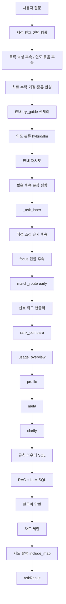

# llm2sql 작동 방식과 알고리즘

**현재 버전: 0.2.2**  
근거: `pyproject.toml`의 `version = "0.2.2"`, FastAPI 앱(`llm2sql/webapp/app.py`)의 `version="0.2.2"`.

> 이 문서는 README, `docs/RND_자연어GIS질의_알고리즘_연구결과보고서.md`, `docs/고도화_llm2_geodb_to_llm2sql.md`, 그리고 `llm2sql/` 아래 실제 소스를 기준으로 작성했다. 코드에 없는 기능은 적지 않는다.

---

## 목차

1. [한 줄 요약 — 이 시스템이 하는 일](#1-한-줄-요약--이-시스템이-하는-일)
2. [사용자가 보는 세 가지 입구](#2-사용자가-보는-세-가지-입구)
3. [전체 파이프라인 흐름](#3-전체-파이프라인-흐름)
4. [단계별 알고리즘 — 질의 시나리오](#4-단계별-알고리즘--질의-시나리오)
5. [하이브리드 의도 분류](#5-하이브리드-의도-분류)
6. [규칙 SQL 라우터 vs RAG+LLM](#6-규칙-sql-라우터-vs-ragllm)
7. [스키마 RAG, few-shot, sql_fix, 검증 체인](#7-스키마-rag-few-shot-sql_fix-검증-체인)
8. [읽기 전용 안전 가드 vs 지도용 temp_* DDL](#8-읽기-전용-안전-가드-vs-지도용-temp_-ddl)
9. [SessionContext — 대화가 이어지는 이유](#9-sessioncontext--대화가-이어지는-이유)
10. [지명 사전, 단위 정규화, 도메인 별칭](#10-지명-사전-단위-정규화-도메인-별칭)
11. [답변 품질 — 템플릿 vs LLM 서술](#11-답변-품질--템플릿-vs-llm-서술)
12. [차트와 지도 발행](#12-차트와-지도-발행)
13. [데이터 관리](#13-데이터-관리)
14. [처리 흐름 한눈에 보는 의사결정 트리](#14-처리-흐름-한눈에-보는-의사결정-트리)
15. [제한 사항과 실패 시 동작](#15-제한-사항과-실패-시-동작)

---

## 1. 한 줄 요약 — 이 시스템이 하는 일

**llm2sql 0.2.2**은 부산 GIS(건물·행정구역·기초구역·산업단지)를 **한국어 자연어**로 물어보면, 내부에서 **PostgreSQL + PostGIS용 SELECT**를 만들고 실행한 뒤 **한국어 답변**을 돌려주는 도구다. 로컬 **Ollama**가 SQL·서술·임베딩을 맡고, 선택적으로 **GeoServer**에 임시 레이어를 올려 지도에 그린다.

한 문장으로 줄이면 다음과 같다.

> 질문 → (안내 / 메타 / 모호 확인 / 특징·비교 / 순위비교 / 규칙 SQL / 선택적 Semantic Query Plan / RAG+LLM) → DB 조회 → 한국어 답변 → (가능하면) 차트 제안 · 지도 레이어

선행 시스템 `llm2_geodb`는 사용자가 준 Spatial SQL을 **안전하게 실행·해석**하는 쪽에 가깝다. llm2sql은 그 안전·메타데이터·지도 기반을 이어받아 **자연어만으로 SELECT를 생성**하는 경로를 채운 것이다.

| 구분 | 내용 |
|------|------|
| 입력 | 한국어 질문 + (선택) 세션 상태 |
| 출력 | `AskResult`: `ok`, `answer`, `sql`, `rows`, `route`, `chart`/`chart_spec`, `map` 등 |
| LLM | Ollama (`qwen3:latest` 등) + 임베딩 (`mxbai-embed-large`) |
| DB | PostgreSQL + PostGIS. 채팅 경로는 SELECT/WITH만 |
| 지도 | GeoServer WMS(기본)·WFS. URL이 비면 채팅만 동작 |
| 입구 | CLI · 웹 채팅 · 지도 3분할 · 데이터 관리 |

주력 테이블은 `AL_D010_26_20250704`(부산 건물통합)이다. 컬럼은 `A4` 법정동명, `A5` 지번, `A9` 용도, `A12` 건물면적, `A14` 연면적, `A16` 높이, `A24` 건물명, `A26` 지상층처럼 **코드 이름**이다. 사용자 답변에는 이 코드를 드러내지 않고 「용도」「높이」처럼 말한다.

---

## 2. 사용자가 보는 세 가지 입구

엔진은 하나(`Llm2SqlEngine`)다. 화면만 다르다.

```text
                    ┌─────────────┐
                    │ Llm2SqlEngine │  DB 연결 + Ollama 재사용
                    │  run_ask()    │
                    └──────┬──────┘
           ┌───────────────┼────────────────┬────────────────┐
           ▼               ▼                ▼                ▼
     CLI (터미널)     웹 채팅 전용      지도 3분할        데이터 관리
     llm2sql          /  · /chat        /map              /data
     include_map      include_map=false include_map=true  쓰기 API
     기본 true
```

### 2.1 CLI — 터미널 대화

진입점: `llm2sql.cli:main` (`uv run llm2sql`, `uv run python -m llm2sql.cli`).

| 사용 | 동작 |
|------|------|
| `llm2sql "해운대구 건물 몇 채야?"` | 한 번 묻고 종료 |
| `llm2sql --chat` | `SessionContext`를 유지한 대화. `질문>` 프롬프트 |
| `-p` / `--progress` | 단계 로그 (`[route]`, `[sql]` …) |
| `-v` / `--verbose` | route · SQL · 행 미리보기 |
| `--json` | `AskResult.to_dict()` 전체 (지도 정보가 있으면 `map` 포함) |

CLI에는 OpenLayers 지도 UI가 없다. 엔진의 `include_map` 기본값은 `True`라 GeoServer가 켜져 있으면 JSON에 레이어 정보가 붙을 수는 있다. 사람이 지도를 보는 화면은 브라우저 `/map`이다.

### 2.2 웹 채팅 전용 (`/`, `/chat`)

FastAPI(`llm2sql/webapp/app.py`)가 같은 HTML(`static/index.html`)을 준다. 버블 챗봇 + SSE(`POST /api/chat`).

- `ChatRequest.include_map` **기본값 `false`** → 임시 GeoServer 레이어를 만들지 않는다.
- 차트(Chart.js), 모호 동 번호 버튼, 후속 질문은 동작한다.
- 세션은 프로세스 메모리 `sessions[session_id]`에 둔다. `POST /api/session`으로 새 ID를 받는다.

웹은 `ask_lock`으로 `engine.ask`를 **한 번에 하나**만 돌린다. 엔진이 단일 DB 연결을 쓰기 때문이다.

### 2.3 지도 3분할 (`/map`)

왼쪽 레이어 · 가운데 OpenLayers · 오른쪽 채팅. 채팅 폭 기본 600px, 드래그로 조절.

오른쪽 채팅도 같은 `/api/chat`이지만 프론트가 **`include_map=true`** 를 보낸다. 적격 GIS 질의만 `temp_*` 레이어가 생기고 분석결과·출력 레이어에 올라간다.

### 2.4 데이터 관리 (`/data`)

Head 메뉴 **데이터 관리**. 채팅 SQL과는 별도 **쓰기 API**다.

| 화면 | 역할 |
|------|------|
| `/data` | 개요 |
| `/data/upload` | Shapefile ZIP → PostGIS 테이블 → GeoServer `korDB` |
| `/data/metadata` | 테이블·컬럼 한글 표시명·설명·단위 (`table_metadata` / `column_metadata`) |

모든 웹 화면은 Head(로고·메인 메뉴: 지도 / 채팅 / 데이터 관리)와 Bottom(버전·스택)으로 둘러싸인다.

### 2.5 라이브러리 엔진

```python
from llm2sql import Llm2SqlEngine, SessionContext

with Llm2SqlEngine.from_env() as engine:
    session = SessionContext()
    r = engine.ask("구서동에서 건물면적이 가장 큰 아파트는?", session=session)
    print(r.ok, r.route, r.answer)
    r2 = engine.ask("그 아파트의 이름은?", session=session)
```

`Llm2SqlEngine.ask`는 `pipeline.run_ask`를 호출하고 결과를 `AskResult`로 감싼다. 연결을 열었다 닫는 일회성 API `ask(question, settings)`도 있다.

---

## 3. 전체 파이프라인 흐름

핵심은 `pipeline.run_ask` → (DB가 필요하면) `_ask_inner` → 성공 시 `attach_chart_offer` → `include_map`이면 `_with_map` → `map.attach_map` 이다.



텍스트로 같은 순서를 적으면 아래와 같다. **의도분류 LLM보다 안내(`try_guide`)가 먼저**인 점이 중요하다. 기능·날씨 같은 질문에 Ollama를 부르지 않기 위해서다.

```text
run_ask
  1. clarify 번호 선택 병합          _rewrite_session_question
  2. 직전 목록에 속성만 덧붙이기      _try_list_attr_followup
  3. 연도 통계를 N년 단위로 재묶기    _try_year_grain_followup
  4. 차트 턴                         _try_chart_turn
  5. 안내·범위 외 (의도분류보다 선)   try_guide
  6. 의도 분류 (followup이 아니면)    classify_intent_hybrid / llm
  7. 안내 재시도                      _try_guide_turn
  8. 짧은 후속 문장 병합              _expand_followup_question
  9. _ask_inner
       9a. 직전 조건 유지 후속        try_subset_followup
       9b. focus 건물 후속            answer_followup
       9c. 규칙 라우트 1회            match_route (optimized)
           early면 즉시 SQL 실행     건물명 / 산업단지 / 순위 / 법정동 구성
       9d. 선호 의도 핸들러           _try_preferred_intent
       9e. rank_compare → usage → profile → meta
       9f. 모호성 점검                check_ambiguity
       9g. deferred 또는 try_route    건수·버퍼·공간 등
       9h. 미적중이면                 run_rag_sql
 10. 표 페이로드                     _ensure_result_table
 11. 차트 제안                       attach_chart_offer
 12. 세션 갱신                       SessionContext.update_from_result
 13. 지도 (include_map)              attach_map → plan_map_sql → temp_*
```

`INTENT_MODE=rules`이면 6번 의도 분류는 건너뛴다(`_classify_intent`가 `None`). 규칙 핸들러(`is_profile_question` 등)와 `try_route`는 그대로 돈다.

---

## 4. 단계별 알고리즘 — 질의 시나리오

아래는 **초심자가 따라갈 수 있게** 같은 형식으로 푼다.

1. 사용자가 치는 말  
2. 내부가 고르는 길 (`route` / `intent`)  
3. 실제로 바뀌는 SQL·세션  
4. 화면에 보이는 답  

숫자는 예시용이다. 실제 DB 건수는 환경마다 다르다.

---

### 시나리오 A. 「기능 알려줘」→ guide

```
사용자: 기능 알려줘
```

**왜 여기로 오나.** `run_ask`는 의도분류 LLM을 부르기 **전에** `guide_qa.try_guide`를 호출한다. `_HELP_HINTS`에 `"기능 알려"`가 있다. 오타(`할수잇는`)도 `_fold_help_typos`로 접는다.

| 항목 | 값 |
|------|-----|
| 모듈 | `guide_qa.try_guide` |
| route | `guide_help` |
| SQL | 없음 |
| 지도 | 없음 (`is_map_route`가 `guide*` 거부) |
| 세션 | `last_route=guide_help`. focus는 유지(기존 건물이 있으면) |

**의사흐름**

```text
try_guide("기능 알려줘")
  → HELP_HINTS 적중
  → "사용가능 데이터" 같은 카탈로그 힌트는 없음
  → GuideAnswer(intent="guide_help", answer=_capabilities_text())
```

**사용자에게 보이는 것.** 부산 GIS를 자연어로 조회한다는 소개, 할 수 있는 질문 유형(건수·순위·특징·비교·메타), 예시 질문. LLM을 거치지 않는 **고정 문구**다.

비슷한 안내 분기:

| 질문 | route | 함수 |
|------|-------|------|
| 안녕하세요 | `guide_greeting` | 인사만 (`_is_greeting_only`) |
| 제한이 뭐야? | `guide_limits` | `_LIMIT_HINTS` |
| 전국자료 있어? | `guide_coverage` | `_is_coverage_question` |
| (빈 질문) | `guide_empty` | 기능 안내 + 질문이 비었다는 머리말 |

---

### 시나리오 B. 「어떤 데이터가 있어?」/「A4 의미가 뭐야?」→ meta

```
사용자: 어떤 데이터가 있어?
사용자: A4 의미가 뭐야?
```

**왜 여기로 오나.** 안내가 아니면 `_ask_inner`에서 `is_metadata_question`이 참이거나, hybrid가 `meta`를 주고 `_try_preferred_intent`가 `answer_metadata_question(..., force=True)`를 부른다.

`meta_qa`는 **DB를 세는 조회가 아니라** `table_metadata` / `column_metadata`와 별칭 표로 **의미를 설명**한다.

| 질문 느낌 | route 예 | 하는 일 |
|-----------|----------|---------|
| 어떤 데이터가 있어? / 사용가능한 데이터 | `meta_catalog` | 등록 테이블 목록·한글명 |
| A4 컬럼 의미가 뭐야? | `meta_column` | 컬럼 코드 → 법정동명 등 |
| 법정동명은 어떤 속성이야? | `meta_column_display` | 한글 표시명으로 역검색 |
| GIS건물통합정보_부산광역시 요약 | 데이터셋 요약 | 스키마 나열이 아니라 건수·상위 용도 쪽 |

테이블 별칭(`_TABLE_ALIASES`) 예:

| 물리 테이블 | 사용자가 말해도 되는 말 |
|-------------|-------------------------|
| `AL_D010_26_20250704` | 건물, 건물통합, d010 |
| `AL_D060_00_20250804` | 산업단지 |
| `AL_D198_26260_…` / `26410_…` | 동래 / 금정 용도별건물 |
| `BND_ADM_DONG_PG` | 행정동, 동경계 |
| `TL_KODIS_BAS_26_202507` | 기초구역 |

**오분류 방지.** 「구서동 건물의 주요 용도는?」처럼 **지역 용도 구성**은 meta가 아니라 `usage_overview`다. `is_metadata_question`은 「몇 채」「상위」 같은 조회 힌트가 있으면 메타로 보지 않는다. 「구서동포르투나 아파트 정보 있나」는 건물명 조회로 빠진다(`looks_like_building_name_lookup`).

**지도.** `meta_*`는 `_SKIP_ROUTES` / `is_map_route`에서 제외. 레이어를 만들지 않는다.

---

### 시나리오 C. 「송정동 건물 몇 채야?」→ 동명 모호 → 「1」선택

부산에는 **강서구 송정동**과 **해운대구 송정동**이 있다. 구를 안 적으면 시스템이 함부로 한쪽을 고르지 않는다.

#### 1턴 — 확인만

```
사용자: 송정동 건물 몇 채야?
```

1. `try_guide` 아님.  
2. hybrid: 규칙이 `sql`(건수 힌트)이라 LLM 생략 가능. 또는 LLM이 `clarify`.  
3. `match_route`가 건수 SQL을 만들어도 **early가 아니면 deferred**로만 들고 간다.  
4. `check_ambiguity`가 `extract_place` → 「송정동」. 구가 없고 `_lookup_places`가 후보 2개 이상이면 여기서 **멈춘다**.

`clarify_qa.check_ambiguity`가 만드는 답 골격:

```text
「송정동」이(가) 여러 지역에 있어 의미가 불분명합니다.
아래 중 어디를 말씀하신 건가요?
1) 강서구 송정동 (건물 N동)
2) 해운대구 송정동 (건물 M동)
번호로 답해도 됩니다. 예: 1 또는 1번
```

| 항목 | 값 |
|------|-----|
| route | `clarify_place` |
| SQL | 아직 없음 (후보 건수는 조회용 집계일 뿐, 본 질의 미실행) |
| `session.last_rows` | `[{place, n}, …]` 선택지 |
| `session.last_full_question` | `송정동 건물 몇 채야?` |
| 지도 | 없음. 확인이 끝나기 전에는 발행하지 않음 |

#### 2턴 — 번호 선택

```
사용자: 1
```

`run_ask` 맨 앞 `_rewrite_session_question` → `resolve_place_clarify_choice`:

```text
last_route == "clarify_place"
parse_choice_index("1") → 1
opts[0].place == "강서구 송정동"
rewrite_question_with_place("송정동 건물 몇 채야?", "강서구 송정동")
  → "강서구 송정동 건물 몇 채야?"
```

「1번」「첫번째」, 또는 **구 이름만**(`강서구`)도 허용한다. 범위 밖 번호면 SQL 없이 「선택 번호는 1~N」만 돌려준다.

다시 파이프라인을 타면 구가 있으므로 clarify를 건너뛰고 `_route_place_building_count`가 SQL을 만든다.

```sql
SELECT COUNT(*) AS cnt
FROM "AL_D010_26_20250704"
WHERE "A4" LIKE '%송정동%' AND "A4" LIKE '%강서구%';
```

답은 템플릿: 「강서구 송정동 건물은 N채입니다.」 비슷한 문장(`_natural_count`).  
지도 화면이면 아래 12절처럼 같은 필터의 **건물 피처**를 올리거나, 그것이 안 되면 **행정 경계**를 올린다.

---

### 시나리오 D. 「구서동에서 제일 좋은 아파트는?」→ 주관 표현 clarify

```
사용자: 구서동에서 제일 좋은 아파트는?
```

「좋은」「추천」「괜찮은」은 **DB에 없는 주관**이다. 높이·면적으로 몰래 바꿔 답하지 않는다.

`check_ambiguity` 1단계 `_VAGUE` 매칭 → `clarify_vague`.  
hybrid도 주관 표현이면 LLM을 생략하고 `clarify`를 채택한다(`_skip_llm_intent`).

**사용자에게 보이는 것** (`_vague_guidance`). 수치 기준을 고르라고 한다. 예: 가장 높은 건물, 연면적이 가장 큰 아파트, 건물면적이 가장 큰 아파트.

세션: `last_route=clarify_vague`. 지도 없음.  
사용자가 「연면적이 가장 큰 아파트」로 다시 물으면 `building_rank_연면적` + 용도 `공동주택`(「아파트」별칭)으로 조회한다.

---

### 시나리오 E. 「해운대구 건물 몇 채야?」→ 규칙 SQL + 지도

```
사용자: 해운대구 건물 몇 채야?
화면: /map (include_map=true)
```

#### 채팅 경로

1. 안내 아님.  
2. hybrid: 규칙 `sql` + 「몇/채야」 → LLM 생략 (`_COUNTISH`).  
3. `match_route_optimized`: `try_route` 1회. 건수는 early allowlist가 아니라 **deferred**.  
4. rank_compare / profile / meta / clarify(구가 있어 동명 모호 아님) 통과.  
5. `try_route` 재사용(또는 재호출) → `_route_place_building_count`.

조건 요약: 「건물/채」+ 건수 힌트, 용도·면적·높이·산업단지·공간 전치사 없음, `extract_gu` = 해운대구.

`spatial_templates.building_scope("해운대구"가 동이면…, gu="해운대구")`  
해운대구는 구이므로 `kind=gu`:

```sql
SELECT COUNT(*) AS cnt
FROM "AL_D010_26_20250704"
WHERE "A4" LIKE '%해운대구%';
```

| 항목 | 값 |
|------|-----|
| route | `building_place_count` |
| 답변 | `format_success_template` — 건수 템플릿 (LLM 서술 안 탐) |
| `session.place` | 해운대구 |

행정동만 있는 이름(예: 구서1동)이면 `uses_admin_boundary`가 참이라 `BND_ADM_DONG_PG`와 `ST_Intersects`하는 `building_in_dong_spatial`이 된다. 해운대구처럼 **구 단위 법정동명(A4) 필터**는 속성 LIKE다.

#### 지도 경로 (`include_map=true`이고 `GEOSERVER_URL`이 있을 때)

채팅이 성공한 뒤 `attach_map` → `plan_map_sql`.

`plan_map_sql` 우선순위 (`map/sql.py`):

1. 안내·메타·clarify·차트 route면 **계획 없음**.  
2. 집계가 **아니면** SELECT에 `geometry`를 넣는다 (`ensure_geometry_select`).  
3. **집계(COUNT 등)** 이면 같은 FROM/WHERE로 **건물 피처 SELECT**를 만든다 (`count_to_feature_sql`). 주석: *건수 질의라도 지도에는 대상 건물을 그린다. 동·구 경계는 최후 수단.*  
4. 피처 변환이 실패하면 `boundary_sql` — 동은 `BND_ADM_DONG_PG` 행정동, 구는 `ADM_CD LIKE '26350%'` 후 `ST_Union`.

해운대구 건수는 3번이 성공하는 경우가 많다.

```sql
SELECT b."A0", b."A4", b."A5", b."A9", b."A12", b."A14",
       b."A16", b."A24", b."A26",
       NULL::text AS "ADM_NM",
       b.geometry AS geometry
FROM "AL_D010_26_20250704" b
WHERE "A4" LIKE '%해운대구%'
LIMIT 2000;   -- MAP_MAX_FEATURES
```

피처 변환이 안 되면:

```sql
SELECT '해운대구' AS "ADM_NM", ST_Union(d.geometry) AS geometry
FROM "BND_ADM_DONG_PG" d
WHERE d."ADM_CD" LIKE '26350%';
```

그다음 `publish_query_layer`: `CREATE UNLOGGED TABLE … temp_[hex] AS <위 SELECT>` → GIST → GeoServer 피처타입 → 웹이 WMS(기본)로 출력 레이어에 추가.

채팅 전용(`/chat`)은 `include_map=false`라 이 단계를 건너뛴다. 답 문장만 나온다.

---

### 시나리오 F. 「부산시에서 가장 높은 건물은?」→ 순위 + 이상값 필터

```
사용자: 부산시에서 가장 높은 건물은?
```

`is_busan_wide`가 참이면 구/동 WHERE를 넣지 않고 **AL_D010 전표**를 본다.

`_route_building_rank`: 「가장 높」→ 지표 `A16`, route `building_rank_높이`.  
early allowlist라 `match_route`가 **즉시 실행**한다 (clarify/meta보다 앞).

이상값 필터 `domain.sane_height_sql("A16", "A26")`:

```text
A16 > 0 AND A16 <= 600
AND (A26 IS NULL OR A16 <= A26 * 8 + 30)
```

날짜가 높이로 들어간 행, 층수에 비해 비정상적으로 높은 값을 뺀다.  
건물면적은 `sane_footprint_sql`(건축면적 ≤ 연면적 근처), 연면적은 `sane_floor_area_sql`(0 초과 · 상한).

```sql
SELECT "A0", "A4", "A5", "A9", "A12", "A14", "A15",
       "A16", "A19", "A24", "A25", "A26"
FROM "AL_D010_26_20250704"
WHERE "A16" > 0 AND "A16" <= 600
  AND ("A26" IS NULL OR "A16" <= ("A26" * 8 + 30))
ORDER BY "A16" DESC NULLS LAST
LIMIT 1;
```

답은 `_natural_rank`: 「부산에서 가장 높은 건물은 ○○로, 높이는 N m입니다.」처럼 **A16을 말하지 않는다**.

세션: `focus_row` = 그 건물 한 행. 다음 「이름은?」이 가능하다.

「제일 넓은」만 있으면 지표 미지정으로 **연면적(A14)** 으로 해석한다.

---

### 시나리오 G. 「장전동과 안락동의 최고 높이 건물을 비교하라」→ rank_compare

```
사용자: 장전동과 안락동의 최고 높이 건물을 비교하라
```

**단일 지역** 「장전동에서 가장 높은 건물」은 `sql` / `building_rank_높이`다.  
**지역이 둘 이상** + 최고 지표 + 비교 말(비교/와/과/vs)이면 `rank_compare_qa`.

`is_rank_compare_question`: `extract_places` ≥ 2, `_detect_metric`이 높이(A16).

지역마다 **따로** LIMIT 1 조회(이상값 필터 포함):

```sql
-- 장전동
SELECT ... FROM "AL_D010_26_20250704"
WHERE <place_a4_predicate 장전동> AND <sane_height>
ORDER BY "A16" DESC NULLS LAST
LIMIT 1;

-- 안락동 동일
```

`intent` = `building_rank_compare_높이`.  
답은 `narrate_building_profile` (LLM 문단) 실패 시 `_prose_rank_compare` 폴백.  
차트: 비교 집계면 `attach_chart_offer`가 막대 스펙을 붙일 수 있다.

지도: 비교 SQL이 여러 문장이면 `count_to_feature_sql`이 각각을 피처로 바꿔 `UNION ALL`한다. 한 레이어에 양쪽 승자 건물이 올라갈 수 있다.

---

### 시나리오 H. 「구서동 아파트의 특징은?」→ profile + 차트 제안

```
사용자: 구서동 아파트의 특징은?
```

`is_profile_question`: 「특징/특성/요약/평균/비교…」.  
「아파트」→ `USAGE_ALIASES` → 용도명 **공동주택** (`A9 = '공동주택'`).

`profile_qa.answer_profile_question`이 건수·평균/중앙 높이·면적·층수 등을 **한 줄 집계**한다. 높이·면적에 이상값 필터를 쓴다. 행정 전용 동이면 `admin_dong_where` + 교차.

답은 `narrate_building_profile`: LLM이 JSON 집계를 **문단**으로 푼다. 실패하면 문장 폴백.

| 항목 | 값 |
|------|-----|
| route | `building_profile` |
| focus | **없음**. 프로필은 집계라 `update_from_result`가 focus를 비움 |
| 차트 | `attach_chart_offer` → `chart_offer=true`, 답 끝에 「차트로 보시겠어요?」 |

사용자가 「응」「차트로 보여줘」면 `_try_chart_turn`이 `pending_chart`를 `chart`로 내려주고 route `chart_render`. 웹이 Chart.js로 그린다.

지역 두 곳 특징 비교는 `building_profile_compare`. 같은 지역 전체 vs 산업단지 안은 `_wants_industrial_compare`.

---

### 시나리오 I. 「그 아파트의 이름은?」→ followup / focus

직전 예: 「부산시에서 가장 높은 건물은?」로 `focus_row`가 채워진 상태.

```
사용자: 그 아파트의 이름은?
```

`is_followup_question`: 세션에 `focus_row`가 있고, 새 장소의 독립 질문이 아니며, 「그 / 그 아파트 / 이름은?」 같은 지시·짧은 속성.

`answer_followup`이 `_ATTR_MAP`에서 「이름/건물명」→ 컬럼 `A24`.  
이미 행에 값이 있으면 **추가 SQL 없이** 그 값을 말한다. 없으면 focus 키로 SELECT.

답 예: 「그 건물의 이름은 「○○」입니다.」  
route `followup_attr`.  
독립 질문(「해운대구 공장 몇 채야?」)이면 `looks_like_standalone_question`이 참이라 followup이 아니다. `run_ask`는 그때 `clear_focus`를 호출할 수 있다.

「지번은?」「높이는?」「몇 층?」도 같은 맵이다.

---

### 시나리오 J. 라우터 미적중 열린 질의 → RAG + LLM

규칙 패턴에 안 맞는 질문 — 예: 여러 조건을 한 문장에 섞거나, 라우터가 모르는 조인 표현.

```
사용자: (라우터에 없는 열린 GIS 질의)
```

`_ask_inner` 끝: `run_rag_sql(..., skip_answer=True)`.

```text
1. retrieve_schema     질문 임베딩 ↔ llm_schema_catalog  top_k=SCHEMA_TOP_K(5)
2. load_name_maps      한글 표시명 → 물리 테이블/컬럼
3. build_few_shot      example_store 유사 예제 EXAMPLE_TOP_K(3)
4. generate_sql        Ollama. SELECT만, 식별자 인용, geometry 기본 제외
5. normalize_sql       rewrite_display_names + fix_common_sql_mistakes
6. 공간 의도인데 ST_* 없으면 재생성, 그래도 없으면 동 경계 템플릿
7. validate_sql_preexec
     diagnose_sql (A3 오용, D198 오판, ORDER BY 누락 …)
     sqlglot.parse_one(..., read="postgres")
     EXPLAIN (USE_EXPLAIN=true)
8. execute_query       assert_readonly_sql + ensure_limit
9. 실패 시 오류를 프롬프트에 넣어 재생성  (SQL_MAX_RETRIES, 기본 3)
10. 0행이면 diagnose 후 한 번 더
11. format_success     route=None → LLM 서술 시도, 뻣뻣하면 템플릿
```

route는 `rag_sql`(내부 dict). 파이프라인 payload의 `route`는 비어 있을 수 있다.  
지도는 SQL이 적격 SELECT면 동일하게 geometry를 넣어 발행한다.

---

### 시나리오 K. 「오늘 날씨」→ out_of_scope

```
사용자: 오늘 날씨 어때?
```

`try_guide` → `_is_out_of_scope`. `_OUT_OF_SCOPE`에 「날씨」「기온」「뉴스」「주식」「코딩해」…가 있다.

| 항목 | 값 |
|------|-----|
| route | `guide_out_of_scope` |
| SQL | 없음 |
| 지도 | 없음 |

답은 거절 + 부산 GIS로 유도 (`_out_of_scope_text`). 날씨 API를 호출하지 않는다.

hybrid의 라벨 `out_of_scope`도 같은 안내 핸들러로 모인다.

---

## 5. 하이브리드 의도 분류

모듈: `intent_classifier.py`. 설정 `INTENT_MODE` = `rules` | `hybrid`(기본) | `llm`.  
임계값 `INTENT_CONFIDENCE_THRESHOLD` 기본 **0.55**.

### 5.1 라벨 (`INTENT_LABELS`)

코드에 있는 아홉 개만 쓴다. 이 밖의 문자열은 `IntentPrediction.ok`가 거짓이다.

| intent | 뜻 | 이어지는 처리 |
|--------|----|----------------|
| `guide` | 기능·역할·인사·제한 | `try_guide` → `guide_help` 등 |
| `coverage` | 전국·타시도 자료 있나 | `guide_coverage`. 오분류면 meta로 재해석 |
| `meta` | 테이블/컬럼/데이터셋 의미 | `answer_metadata_question` |
| `usage_overview` | 지역 건물 용도 구성 | `answer_usage_overview_question` |
| `profile` | 특징 요약·지역 비교 | `answer_profile_question` |
| `rank_compare` | **둘 이상** 지역 최고 건물 비교 | `answer_rank_compare` |
| `sql` | 건수·순위·목록·공간 등 조회 | 규칙 라우터 또는 RAG |
| `clarify` | 동명 모호·주관 표현 | `check_ambiguity` |
| `out_of_scope` | GIS 밖 | `guide_out_of_scope` |

**한 지역의 「가장 높은」은 `sql`이지 `rank_compare`가 아니다.** 시스템 프롬프트와 hybrid 보정이 이를 강제한다.

### 5.2 세 모드

```text
rules   : predict_intent_rules만. 파이프라인은 분류를 건너뛰고 규칙 체인만.
llm     : classify_intent_llm만. JSON {"intent","confidence","reason"}.
hybrid  : 규칙 고신뢰면 LLM 생략. 아니면 LLM. 저신뢰·알려진 오분류는 규칙으로 되돌림.
```

`classify_intent_hybrid` 의사코드:

```text
rules ← predict_intent_rules(q)
if _skip_llm_intent(rules, q):
    return rules   # source=hybrid, 이유="규칙 고신뢰"
llm ← classify_intent_llm(q)   # 실패 시 rules
if 데이터셋 내용 질문: return meta
if 주관 표현: return clarify
if rules==sql and llm==rank_compare and 지역이 하나:
    return sql     # 단일지역 순위 보정
if llm.confidence >= threshold:
    if llm==coverage and 범위질문이 아니면: 규칙 또는 meta
    return llm
return rules       # 저신뢰
```

`_skip_llm_intent`가 참인 경우 (LLM 비용·오분류 방지):

- guide / coverage / out_of_scope 이고 신뢰도 ≥ 0.9  
- rank_compare / usage_overview / meta / profile 이고 ≥ 0.85  
- 주관 표현 clarify  
- sql + 건수 힌트 또는 「가장 큰/높」 또는 건물명 조회·수치 임계  

의도 분류가 예외로 죽으면 진행 로그만 남기고 **규칙 체인으로 계속**한다.

`_try_preferred_intent`는 `guide`/`coverage`/`out_of_scope`/`sql`을 **여기서 처리하지 않는다**. sql은 라우터·RAG가 담당한다.

---

## 6. 규칙 SQL 라우터 vs RAG+LLM

### 6.1 왜 둘로 나눴나

고빈도 질문(「○○구 건물 몇 채」「가장 높은 건물」)을 매번 LLM에 맡기면

- 수 초~수십 초가 걸리고  
- `A3`를 법정동으로 쓰거나 D198만 보는 실수가 나고  
- 같은 질문에 다른 SQL이 나온다.

그래서 **맞출 수 있는 패턴은 템플릿 SQL**(`intent_router.try_route` + `spatial_router.try_spatial_route`)로 고정하고, **남은 열린 질의만** 스키마 RAG + 생성에 넘긴다.

### 6.2 `try_route` 우선순위

`intent_router.try_route`는 아래 순서로 **첫 적중만** 반환한다.

```text
산업단지 건물/이름/건수
  → try_spatial_route          행정동·기초구역·버퍼·인접·법정동 구성/비율
  → D198 / 카탈로그 전 속성     (건물명 조회가 아닐 때)
  → 용도 종류
  → 면적·높이·층 임계
  → 구조·특수지
  → 건물 순위                   building_rank_*
  → 지명 버퍼
  → 건물명 조회                 building_name_lookup
  → 좌표 버퍼                   ST_DWithin geography
  → 기초구역∩산업단지 / 기초구역 건수
  → 건축년수 (동래·금정 D198)
  → 공공시설 목록
  → 장소+용도 건수 / 장소 건물 건수
  → 동 내부 ST_Intersects
  → 산업단지 코드 26%
  → 구 연면적 상위 N / 기초구역 면적 상위 N
```

공간 라우터(`spatial_router`)가 속성 COUNT보다 **앞**인 이유: 「연산동 안에 건물」을 `A4 LIKE`로만 세면 행정동 경계와 어긋난다.

### 6.3 디스패치 최적화 (`route_dispatch`)

`ROUTE_DISPATCH_MODE` 기본 `optimized`.

| 모드 | 동작 |
|------|------|
| `optimized` | `try_route` **1회**. early면 바로 실행, 아니면 `deferred`로 보관해 clarify/meta 이후 재사용 |
| `baseline` | early 구간에서 `try_route`를 여러 번 호출하던 예전 방식 (벤치용) |

early allowlist (`_is_early_intent`):

- `building_name_lookup`  
- 산업단지: `industrial_count`, `industrial_code_prefix`, `industrial_names`, `buildings_in_industrial`  
- `legal_dong_admin_members`  
- `building_rank_*`  

건수(`building_place_count`)는 early가 **아니다**. 송정동처럼 모호 확인을 먼저 하기 위해서다.

`RoutedQuery`는 `{intent, sql}` 한 쌍이다. 실행은 `_finish_routed_query` → `execute_query` → `format_success`.

---

## 7. 스키마 RAG, few-shot, sql_fix, 검증 체인

이 절은 **라우터 미적중**일 때의 `rag_sql.run_rag_sql`이다.

### 7.1 스키마 RAG (`schema_retriever.retrieve_schema`)

1. 질문을 임베딩 모델로 벡터화 (`embed_text`, 400자 절단).  
2. `llm_schema_catalog`에서 코사인(또는 DB에 정의된 거리)으로 **top_k 테이블**을 고른다.  
3. 구·동·행정 키워드가 있으면 `BND_ADM_DONG_PG`, `TL_KODIS_BAS_26_202507` 등을 강제 포함.  
4. 컬럼 설명·동의어(`semantic_meta`)·(설정 시) 샘플 값을 붙여 `schema_text`를 만든다.

카탈로그는 `scripts/refresh_schema_catalog.py`로 갱신한다. 임베딩 차원과 모델이 같아야 한다.

### 7.2 few-shot (`example_store` + `sql_generator`)

- 정적 `EXAMPLE_BANK`: 해운대 연면적 상위, 기초구역, 좌표 버퍼, 동 주변 100m 등.  
- 질문 임베딩과 예제 질문의 유사도로 `EXAMPLE_TOP_K`(기본 3)를 고른다.  
- `prompt_examples.FEW_SHOT_EXAMPLES`와 `domain_hints()`가 시스템 프롬프트에 붙는다.

생성 규칙 요지 (`sql_generator._SYSTEM_PROMPT`):

- SQL만 출력. SELECT/WITH만.  
- 물리명 인용 (`"AL_D010_26_20250704"`, `"A4"`). 한글 표시명을 식별자로 쓰지 말 것.  
- 기본은 geometry/`SELECT *` 금지.  
- 거리(m)는 `::geography` + `ST_DWithin`.  
- 「안에/내부」는 `BND_ADM_DONG_PG`와 `ST_Intersects`.

### 7.3 이름 교정 (`sql_fix` + `fix_common_sql_mistakes`)

| 단계 | 함수 | 하는 일 |
|------|------|---------|
| 표시명 → 물리명 | `rewrite_display_names` | `table_metadata`/`column_metadata` 맵 |
| 인용 | `quote_known_identifiers` | 대소문자 테이블이 소문자로 접히지 않게 |
| 흔한 실수 | `intent_router.fix_common_sql_mistakes` | 한글 구/동 필터의 `"A3"` → `"A4"` 등 |

### 7.4 검증 체인 (`sql_validator.validate_sql_preexec`)

순서 고정: **도메인 진단 → sqlglot → EXPLAIN**.

`diagnose_sql`이 잡는 예:

- 한글 동/구를 `A3`로 필터  
- 부산 전역·구 건물인데 D198만 사용  
- 높이 순위에 D198 `A30`  
- 건축년수에 데이터기준일 `A35`  
- 순위인데 `ORDER BY` 없음  
- 미터 버퍼인데 `geography` 또는 `BND_ADM_DONG_PG` 없음  

`check_sql_syntax`: `sqlglot.parse_one(sql, read="postgres")`.  
`explain_sql`: 읽기 가드 후 `EXPLAIN …` (행을 가져오지는 않음). 실패하면 연결 `rollback`.

실행 후 0행이면 `diagnose_sql(..., row_count=0)`으로 한 번 더 생성한다.

---

## 8. 읽기 전용 안전 가드 vs 지도용 temp_* DDL

두 길이 **같은 함수를 쓰되 역할이 다르다**.

### 8.1 채팅 경로 — 읽기만 (`db.py`)

`execute_query`는 항상:

1. `assert_readonly_sql`  
2. `ensure_limit` (기본 `DEFAULT_LIMIT=100`)  
3. 실행 후 geometry/WKB는 `"<geometry omitted>"` 로 지움 — 채팅 JSON에 도형을 넣지 않음  

`assert_readonly_sql`:

```text
- 시작이 SELECT 또는 WITH 가 아니면 거부
- 세미콜론으로 문장 2개면 거부
- insert/update/delete/drop/alter/truncate/create/grant/revoke/copy/call/execute/do 거부
```

`ensure_limit`: 이미 LIMIT이 있거나, GROUP BY 없는 순수 COUNT, 또는 GROUP BY 집계면 LIMIT을 강제하지 않는다. 그 외 목록 조회는 LIMIT을 붙인다.

### 8.2 지도 경로 — 서버만 쓰는 DDL (`map/publish.py`)

채팅 SQL은 그대로 SELECT다. 발행 단계에서만:

```text
assert_readonly_sql(plan.sql)          # 넣는 SELECT 자체는 읽기
CREATE UNLOGGED TABLE schema.temp_[hex] AS <SELECT>
GIST 인덱스 + ANALYZE
GeoServer 피처타입 등록
```

레이어 이름 정규식: `^temp_[0-9a-f]{8,32}$` (`is_safe_layer_name`).  
원본 KorDB 테이블(`AL_D010_…` 등)은 `DELETE /api/map/layer/{name}`이 **거부**한다.

스키마는 설정 `MAP_SCHEMA`(기본 `public`). 식별자는 `[a-z][a-z0-9_]*`만 허용.

TTL: `MAP_RETENTION_HOURS`(기본 24). 세션당 `MAP_MAX_ANALYSIS_LAYERS`(기본 8). 넘치면 오래된 `temp_*`를 지운다(`trim_session_layers`). 웹 lifespan에서 `start_cleanup_scheduler`.

**비밀번호·계정은 `.env`만.** 소스에 GeoServer 암호를 넣지 않는다.

---

## 9. SessionContext — 대화가 이어지는 이유

파일: `session.py`. 웹은 `session_id`로 이 객체를 보관하고, CLI `--chat`은 프로세스 하나에서 재사용한다.

| 필드 | 역할 |
|------|------|
| `last_question` | 방금 처리한 문장 |
| `last_full_question` | 장소·연수가 있는 **본질문**. 「1」「10년 단위」에 덮어쓰지 않음 |
| `last_route` | `clarify_place`, `building_rank_높이` 등 |
| `last_sql` / `last_answer` / `last_rows` | 직전 결과. 번호 선택지·목록 후속에 사용 |
| `focus_row` / `focus_index` | 순위·단일 건물 행. 「그 아파트」 |
| `place` / `usage` / `table` | 추출한 동·구, 용도, 주 테이블 |
| `pending_chart` | 「차트로 볼까?」 대기 스펙 |
| `last_chart` | 이미 그린 차트. 종류 변경·시리즈 필터용 |
| `last_map_scope` | FROM/JOIN/WHERE 지문 (`map_scope_key`) |
| `last_map_payload` | 재사용할 레이어 URL·extent |

### 9.1 번호 선택

`last_route == clarify_place` 이고 입력이 `1` / `1번`이면 질문을 구+동으로 다시 쓴다. 세션의 `last_rows`가 선택지다.

### 9.2 focus

`update_from_result`가 focus를 잡는 경우:

- route가 `building_rank_*` 또는 `building_name_lookup`  
- 또는 성공 SQL이 `AL_D010`이고 정규화 행이 **1건**이며 `A0`/`A24` 등이 있음  

프로필(`building_profile`)은 집계라 focus를 비운다.  
`guide_*` / `meta_*` / `chart_*` / `clarify_*`는 **기존 focus를 유지**한다. 「기능 알려줘」 다음 「이름은?」이 동작할 수 있다.

### 9.3 차트 대기

`chart_offer`가 있으면 `pending_chart`에 스펙을 넣는다.  
「응」→ `chart_render` 후 pending은 비우고 `last_chart`만 남긴다.  
「아니」→ `chart_decline`, 둘 다 비움.  
「막대로」「높이만」은 `last_chart`를 바꾼다.

### 9.4 지도 재사용

같은 `map_scope_key`(SELECT 목록·LIMIT을 뺀 FROM/WHERE)이고 GeoServer에 레이어가 아직 있으면 **새로 `temp_*`를 만들지 않는다**. `map.reused=true`.  
「해운대구 건물 몇 채」다음 「그 중 아파트는?」처럼 범위가 같으면 레이어를 재사용한다.

---

## 10. 지명 사전, 단위 정규화, 도메인 별칭

### 10.1 지명 사전 (`gazetteer.py` + `gazetteer_data.json`)

정규식 `~동`만 쓰면 「구서역」「공동주택」도 동으로 오탐한다.  
등록된 시도·구군·법정동·행정동만 **트라이 최장일치**로 찾는다 (`find_places`).

| 종류 | 용도 |
|------|------|
| 법정동 (`legal_dong`) | 건물 주소 `A4` LIKE / `place_a4_predicate` |
| 행정동만 (`admin_dong`이고 법정 아님) | `uses_admin_boundary` → `BND_ADM_DONG_PG` 교차 |
| 구·군 | `A4 LIKE '%해운대구%'` 또는 `ADM_CD` 접두 |

짧은 「리」(원리·고리)는 단어 경계일 때만 채택한다. 시도 별칭 「부산」은 건물명(부산대학교) 오탐 때문에 스캔에서 뺀다.

`legal_dong_guess("구서1동")` → `구서동`. 행정동 구성 목록은 `legal_dong_admin_members`.

### 10.2 단위 (`units.py`)

질문의 「500m」「2km」「30평」을 스키마 단위(m, ㎡)로 바꾼다.

- 1평 = 400/121 ㎡  
- `convert_for_schema(값, 단위, 목표)`  
- 버퍼 각도 여유: m / 111000 × 1.5 (`spatial_router._parse_meters`)  
- 「평수/평형/평방」은 면적 단위 평이 아님  

답변 쪽 `with_pyeong`은 면적을 평으로 **덧붙일 때** 쓴다. Identify 팝업(`map/explain.py`)은 평 환산을 하지 않고 ㎡·m·층만 쓴다.

### 10.3 도메인 별칭 (`domain.py`)

| 사용자가 말함 | DB 값 |
|---------------|--------|
| 아파트 | `A9 = '공동주택'` |
| 창고 | `창고시설` |
| 학교 | `교육연구시설` |
| 공공시설 | `공공용시설` |
| 철근콘크리트 등 | `A11` ILIKE 패턴 |

구 코드 `BUSAN_GU_CODES`: 해운대구 `26350` 등. 지도 구 경계 `ADM_CD LIKE '26350%'`.

---

## 11. 답변 품질 — 템플릿 vs LLM 서술

`answer.format_success`가 경로를 나눈다.

| route 성격 | 생성 방식 | 이유 |
|------------|-----------|------|
| 건수 (`_SIMPLE_COUNT_ROUTES`) | 템플릿 `_natural_count` | 숫자만 정확하면 됨 |
| `building_rank_*` | 템플릿 `_natural_rank` | 컬럼코드 노출 방지 |
| 건물명 조회, 법정동 구성/비율, 임계 목록 | 템플릿 | 목록 형식이 고정 |
| 연도/구간 통계 | 템플릿 + HTML 표(`table`) | 분포 표 |
| 그 밖 (RAG 등) | LLM `generate_natural_answer` | 실패·뻣뻣함·날짜 누락이면 템플릿 |
| profile / rank_compare | `narrate_building_profile` | 문단. 실패 시 폴백 문장 |

**컬럼코드 비노출.** `_label_row`, `_natural_rank`는 `A9` 대신 「용도」를 쓴다. Identify 프롬프트도 `A24`, `AL_D010`을 쓰지 말라고 한다.

범위가 데이터보다 넓을 때(건축년수는 동래·금정만) `coverage_preface`를 답 앞에 붙인다. route `building_age_count_d198_partial`.

실패 답 `format_failure`는 예외명을 그대로 던지지 않고 `_humanize_error`로 풀어 쓴다.

스트림: `on_token`이 있으면 `emit_text_chunks`로 조각을 보낸다. 웹 SSE `type=token`.

---

## 12. 차트와 지도 발행

### 12.1 차트 (Chart.js 스펙)

모듈: `chart_qa.py`. 서버는 **그리기 라이브러리를 실행하지 않고** JSON 스펙만 준다. 웹이 CDN Chart.js로 렌더한다.

`build_chart_spec`이 붙는 전형적인 경우: 특징/비교 집계, 용도 개수, 연도 분포 등 **이름+숫자 행**.  
`attach_chart_offer`가 답 끝에 고정 문구를 붙인다.

```text
이 내용을 차트로도 정리할 수 있어요. 차트로 보시겠어요?
```

스펙 필드 예: `type`(bar / doughnut / pie / line), `title`, `labels`, `datasets`, `all_datasets`, `unit`.

후속 질문:

| 사용자 | route | 동작 |
|--------|-------|------|
| 응 / 차트로 보여줘 | `chart_render` | `pending_chart`를 `chart`로 전달 |
| 아니 | `chart_decline` | 텍스트만 |
| 막대로 / 도넛으로 | `chart_render` | `with_chart_type` |
| 높이만 그려라 | `chart_render` 또는 `chart_help` | `filter_chart_series` |
| 어떤 차트 가능해? | `chart_help` | `chart_capability_answer` |

차트 전용 route는 지도를 만들지 않는다.

### 12.2 지도 발행 알고리즘

진입: `pipeline._with_map` → `map.attach.attach_map`.  
실패해도 `result["map"] = {available: false, error}`만 넣고 **`answer`는 그대로**다.

```text
attach_map
  ok가 아니면 그대로 반환
  _reuse_map  (last_map_scope 일치 + layer_is_published)
  아니면 publish_query_layer
      GEOSERVER_URL 없으면 None  (채팅만)
      plan_map_sql
      GeoServer check 실패 → available:false
      CREATE UNLOGGED TABLE temp_* AS plan.sql
      geometry 없으면 테이블 삭제 후 실패 dict
      GIST, 피처타입, extent, WFS 허용 여부
```

#### geometry 주입 (`ensure_geometry_select`)

채팅 SELECT에는 보통 geometry가 없다. 지도용으로:

- 별칭이 보이면 `alias.geometry AS geometry`를 SELECT 목록에 추가  
- `WITH` / 서브쿼리 FROM이면 `_wrap_join_geometry`: `A0` 또는 `A4+A5`로 D010에 LATERAL JOIN, 또는 `ADM_CD`/`BAS_ID`로 경계·기초구역 JOIN  
- 건물명 조회(`DISTINCT ON` UNION)가 이 경로다  

LIMIT은 `MAP_MAX_FEATURES`(기본 2000).

#### COUNT → 피처 → (최후) 경계

`plan_map_sql`:

1. 비집계 → geometry 주입, `kind=features`  
2. 집계 → `count_to_feature_sql` (같은 필터의 건물/기초구역 도형), `kind=features`  
3. 둘 다 실패 → `boundary_sql` → `BND_ADM_DONG_PG`, `kind=boundary`  

구 코드가 있으면 `ST_Union`. 동이면 `admin_dong_where`(「구서동」과 `구서[0-9]+동` 정규식).

#### WMS / WFS

발행 결과는 기본적으로 `rendering: "wms"`.  
`feature_count <= MAP_WFS_MAX_FEATURES`(5000)이면 `wfs_allowed=true`. 프론트가 벡터 WFS를 고를 수 있다.  
분석 레이어는 ImageWMS, KorDB는 TileWMS 쪽으로 쓰는 것이 웹 구현이다.

작은 건물 bbox는 `pad_lonlat_extent`가 최소 약 0.003°(~330m)와 15% 여백을 준다.

#### Identify 팝업 (`map/explain.py`)

지도를 클릭하면 맨 위 **출력 레이어**부터 속성을 본다.  
`POST /api/map/explain`이 LLM으로 2~4문장 설명을 만든다. **채팅 버블에 넣지 않고 팝업에만** 넣는다.  
타임아웃 18초. 코드명 금지, 없는 통계 금지.

#### 레이어 스택 (`map/layers.py`)

출력 목록 index 0 = 지도에서 가장 위.  
분석 z는 100부터, KorDB는 20부터, 배경은 0.  
배경(OSM / Carto Dark / ESRI Imagery)은 **최대 1개**.

우클릭: 분석 레이어는 GeoServer·임시 테이블까지 삭제. KorDB는 출력에서만 제거.

KorDB 목록은 `/api/map/layers` — `temp_*` 제외. 한글 표시명은 `table_metadata`.

---

## 13. 데이터 관리

채팅의 `assert_readonly_sql`과 **분리**된 쓰기 경로다. 라우터: `data/router.py` prefix `/api/data`.

### 13.1 Shapefile 업로드 (`data/upload.py`)

```text
ZIP 검증 → 압축 해제 → 첫 .shp
table_from_shapefile(파일명)
is_protected_table 이면 거부
  (table_metadata, llm_schema_catalog, temp_* …)
GeoPandas로 읽기 (utf-8 / euc-kr / cp949 …)
CRS → EPSG:4326
같은 이름 테이블이면 덮어쓰기
GeoServer korDB에 레이어 등록 (실패해도 DB 적재는 유지)
register_uploaded_dataset  (D198 커버리지·임베딩 시도)
```

보호 테이블과 `temp_*` 이름으로는 업로드할 수 없다.

### 13.2 메타데이터 (`data/catalog.py`)

| API | 역할 |
|-----|------|
| `GET /api/data/tables` | 공간 테이블 + 표시명 |
| `GET …/structure` | 컬럼 구조 |
| `GET …/metadata` | `table_metadata` + DB 주석 |
| `GET …/parse` | `AL_D198_26_…` 같은 코드를 `col_def`/`pnu_def`로 해석해 추천 한글명 |
| `POST /api/data/metadata` | 표시명·설명·단위 저장. `new_table_name`이면 rename |

엔진 기동 시 `refresh_dataset_coverage`를 한 번 시도한다(실패는 무시). D198 구 커버리지가 질문 라우팅에 쓰인다.

업로드·메타 API가 채팅 SELECT를 열어 주지는 않는다. 반대로 채팅이 Shapefile을 쓰지도 않는다.

---

## 14. 처리 흐름 한눈에 보는 의사결정 트리

```text
질문 u
 │
 ├─ 직전이 clarify_place 이고 u가 번호/구이름? ──예──▶ 질문 재작성 후 아래로
 │
 ├─ 차트 대기 중이고 u가 응/아니/막대/높이만? ──예──▶ chart_*  (지도 없음)
 │
 ├─ try_guide 적중? ──예──▶ guide_* / out_of_scope / coverage
 │
 ├─ (hybrid/llm) 의도 I
 │     guide/coverage/out_of_scope → 안내
 │     그 외는 힌트로만 사용
 │
 ├─ focus 있고 「그 아파트 이름」? ──예──▶ followup_attr
 │
 ├─ match_route.early (이름/산업단지/순위/구성동)? ──예──▶ 템플릿 SQL 실행
 │
 ├─ I = rank_compare / usage / profile / meta / clarify 이고 핸들러 성공?
 │     ──예──▶ 해당 QA
 │
 ├─ 규칙 is_rank_compare / usage / profile / meta?
 │     ──예──▶ 해당 QA
 │
 ├─ check_ambiguity 걸림? ──예──▶ clarify_*  (지도 없음)
 │         미지 용어는 map_unknown_to_router 후 재시도
 │
 ├─ deferred 또는 try_route 적중? ──예──▶ 템플릿 SQL 실행
 │
 └─ run_rag_sql ──▶ 검증 루프 ──▶ 실행 ──▶ 서술
           │
           ▼
     성공이면 attach_chart_offer
           │
           ▼
     include_map? ──예──▶ plan_map_sql
                              ├─ 재사용 last_map_scope
                              ├─ features (geometry 주입 / COUNT→피처)
                              └─ boundary (BND_ADM_DONG_PG)
                         GeoServer 실패 → map.available=false, 채팅 유지
```

**의도 라벨과 route 문자열은 다르다.** 분류기 `sql`은 나중에 `building_place_count` 같은 **세부 route**가 된다. 분류기 `guide`는 `guide_help`로 구체화된다.

---

## 15. 제한 사항과 실패 시 동작

코드와 README가 같이 말하는 한계다. 더 있다고 과장하지 않는다.

1. **등록된 부산 GIS만.** 날씨·뉴스·코딩·잡담은 `guide_out_of_scope`. 전국 자료 없음(`guide_coverage`).  
2. **주관 평가 없음.** 「좋은/추천」은 `clarify_vague`로 수치 기준을 묻는다.  
3. **동명 충돌은 확인 후.** 송정동은 번호 또는 구 이름.  
4. **채팅은 읽기 전용.** 쓰기·DDL 키워드 차단. 지도 `temp_*`만 서버가 생성·삭제.  
5. **후속은 세션·focus 필요.** 웹 `session_id` 또는 CLI `--chat`. 일회성 CLI는 「그 아파트」가 실패한다.  
6. **LLM 경로는 느릴 수 있다.** 안내·건수·순위는 규칙을 타면 Ollama를 건너뛴다.  
7. **웹은 ask를 직렬화** (`ask_lock`).  
8. **GeoServer 미설정·다운·발행 실패 → 지도만 생략, 채팅 유지.** `attach_map`이 예외를 삼킨다.  
9. **배경지도는 0개 또는 1개.**  
10. **건축년수(사용승인)는 등록된 D198 구(동래·금정 등)만.** 다른 구는 `clarify_unsupported_age`.  
11. **지도 피처 상한** `MAP_MAX_FEATURES`(2000). 해운대 전체 건물을 다 올리지는 않을 수 있다.  
12. **Identify 설명 실패** 시 팝업만 비고 채팅은 그대로.  
13. **업로드 GeoServer 등록 실패**여도 PostGIS 적재는 남을 수 있다. 메시지에 남긴다.  
14. **원본 테이블 삭제 API 거부**는 정상이다.

예외가 `_ask_inner` 밖에서 나면 `format_failure` + `ok=false`. SQL이 있었다면 답에 힌트만 남기고 쓰기는 하지 않는다.

---

## 부록 A. 모듈 ↔ 역할

| 파일 | 역할 |
|------|------|
| `pipeline.py` | `run_ask`, `_ask_inner`, 차트/안내/세션 병합 |
| `engine.py` | 연결·Ollama 재사용, `AskResult` |
| `session.py` | `SessionContext` |
| `types.py` | `AskResult` |
| `config.py` | `Settings` / 환경 변수 |
| `intent_classifier.py` | `INTENT_LABELS`, hybrid |
| `intent_router.py` | `try_route`, `RoutedQuery`, `fix_common_sql_mistakes` |
| `route_dispatch.py` | early / deferred |
| `spatial_router.py` | `try_spatial_route` |
| `spatial_templates.py` | COUNT/목록/버퍼/경계 SQL 조각 |
| `schema_retriever.py` | 스키마 임베딩 검색 |
| `sql_generator.py` | Ollama SQL 생성 |
| `sql_fix.py` | 표시명·인용 교정 |
| `sql_validator.py` | 도메인 + sqlglot + EXPLAIN |
| `rag_sql.py` | RAG 루프 |
| `example_store.py` | few-shot 뱅크 |
| `db.py` | 읽기 가드, LIMIT, geometry 제거 |
| `guide_qa.py` / `meta_qa.py` / `clarify_qa.py` | 안내·메타·모호 |
| `profile_qa.py` / `rank_compare_qa.py` / `followup_qa.py` | 특징·비교·후속 |
| `answer.py` / `chart_qa.py` | 한국어 답·차트 스펙 |
| `domain.py` / `gazetteer.py` / `units.py` | 별칭·지명·단위 |
| `map/attach.py` `sql.py` `publish.py` `layers.py` `explain.py` | 지도 |
| `data/upload.py` `catalog.py` | 업로드·메타 |
| `webapp/app.py` / `cli.py` | 입구 |

---

## 부록 B. 설정 키 (파이프라인에 직접 영향)

| 변수 | 기본 | 영향 |
|------|------|------|
| `INTENT_MODE` | `hybrid` | 의도 분류 |
| `INTENT_CONFIDENCE_THRESHOLD` | `0.55` | hybrid LLM 채택 |
| `ROUTE_DISPATCH_MODE` | `optimized` | try_route 횟수 |
| `SCHEMA_TOP_K` | `5` | RAG 테이블 수 |
| `EXAMPLE_TOP_K` | `3` | few-shot 수 |
| `SQL_MAX_RETRIES` | `3` | 실행 실패 재생성 |
| `USE_EXPLAIN` | `true` | 사전 EXPLAIN |
| `DEFAULT_LIMIT` | `100` | 채팅 SELECT LIMIT |
| `GEOSERVER_URL` | (없음) | 비면 지도 생략 |
| `MAP_MAX_FEATURES` | `2000` | 지도 SELECT LIMIT |
| `MAP_WFS_MAX_FEATURES` | `5000` | WFS 허용 상한 |
| `MAP_RETENTION_HOURS` | `24` | temp_* TTL |
| `MAP_MAX_ANALYSIS_LAYERS` | `8` | 세션당 분석 레이어 |
| `SEMANTIC_PLAN_MODE` | `off` | SQP `off` / `shadow` / `hybrid` |
| `SEMANTIC_PLAN_MAX_RETRIES` | `1` | Plan JSON repair |
| `SEMANTIC_PLAN_MIN_QUALITY` | `0.85` | 미만이면 RAG fallback |
| `SEMANTIC_PLAN_DEBUG` | `false` | Plan 디버그 필드 |

---

## 부록 C. 관련 문서

- 제품 사용법·환경 변수: 저장소 루트 `README.md`  
- Semantic Query Plan: `docs/Semantic_Query_Plan_구현.md`  
- 연구용 기호·벤치·선행 대비: `docs/RND_자연어GIS질의_알고리즘_연구결과보고서.md`  
- llm2_geodb → llm2sql 고도화 대조: `docs/고도화_llm2_geodb_to_llm2sql.md`  

이 문서는 **0.2.2 코드가 지금 어떻게 도는지**를 시나리오로 설명하는 쪽에 맞춰 두었다. `SEMANTIC_PLAN_MODE` 기본값은 `off`이며, 켜면 규칙 라우터 미적중 구간에 SQP가 들어간다.
